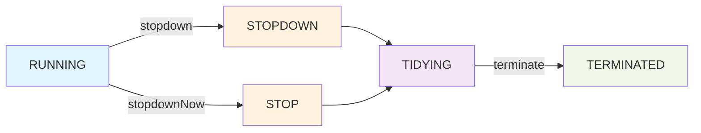

# 1. 安装

在linux上安装jdk

## 1.1. 解压

```
tar -xzvf jdk 
```

  

## 1.2. 配置环境变量

```
export $JAVA_HOME=/jdk/bin/
```

  

# 2. jvm内存模型

## 2.1.

# 3. 字符串

## 3.1. 字面量

```
String str="xxxxxx"
```

形如String s = "xxx";定义String的时候，xxx被我们称之为字面量，这种字面量在编译之后会以常量的形式进入到Class常量池

### 3.1.1. 编译期字符串长度

String的构造函数指定的长度是可以支持2147483647(2^31 - 1)

常量字符串过长

```
String s = "11111...1111";//其中有10万个字符"1"
```

字符串的长度是有要求的不是等于int的长度

```
private void checkStringConstant(DiagnosticPosition var1, Object var2) {

    if (this.nerrs == 0 && var2 != null && var2 instanceof String 
        && ((String)var2).length() >= 65535) {

        this.log.error(var1, "limit.string", new Object[0]);

        ++this.nerrs;

    }

}
```

代码中可以看出，当参数类型为String，并且长度大于等于65535的时候，就会导致编译失败。

这个地方大家可以尝试着debug一下javac的编译过程（视频中有对java的编译过程进行debug的方法），也可以发现这个地方会报错。

如果我们尝试以65534个字符定义字符串，则会发现可以正常编译。

## 3.2. 运行期限制

上面提到的这种String长度的限制是编译期的限制，也就是使用String s= “”;这种字面值方式定义的时候才会有的限制。

这里指的是在运行期通过+ ,等手段添加的字符串

运行期最大字符串长度不超过int表示的范围

```
2^31-1 =2147483647 个 16-bit Unicodecharacter

2147483647 * 16 = 34359738352 位

34359738352 / 8 = 4294967294 (Byte)

4294967294 / 1024 = 4194303.998046875 (KB)

4194303.998046875 / 1024 = 4095.9999980926513671875 (MB)

4095.9999980926513671875 / 1024 = 3.99999999813735485076904296875 (GB)
```

## 3.3. 字符串长度限制

字符串有长度限制，在编译期，要求字符串常量池中的常量不能超过65535，并且在javac执行过程中控制了最大值为65534。

在运行期，长度不能超过Int的范围，否则会抛异常。

# 4. java工具

## 4.1. maven

Maven 是一个项目管理和自动化构建工具，它基于项目对象模型（POM，Project Object Model）的概念。Maven 简化了项目的构建、依赖管理和项目信息管理。通过使用 Maven，开发者可以定义项目的构建过程、依赖关系、插件等，并通过简单的命令来执行项目的编译、测试、打包、部署等任务。

### 4.1.1. 导入本地jar到项目

#### 4.1.1.1. 通过mvn导入jar包

使用`mvn install:install-file`命令Maven提供了一个`install:install-file`的goal，允许你将本地jar包安装到本地仓库中。你需要提供jar包的位置、groupId、artifactId、version以及（可选的）packaging类型（通常是jar）。

- `<path-to-file>`：你的jar包文件的完整路径。
- `<group-id>`：你的项目的groupId，通常是一个组织或公司的反向域名。
- `<artifact-id>`：你的项目的artifactId，通常是项目的名称或模块名称。
- `<version>`：你的项目的版本号。
- `<packaging>`：打包类型，对于jar包来说，通常是`jar`。

```
mvn install:install-file -Dfile=<path-to-file> -DgroupId=<group-id> -DartifactId=<artifact-id> -Dversion=<version> -Dpackaging=<packaging>
```

```
mvn install:install-file -Dfile=path/to/my-library.jar -DgroupId=com.example -DartifactId=my-library -Dversion=1.0-SNAPSHOT -Dpackaging=jar
```

#### 4.1.1.2. 将jar包添加到项目中，然后再pom文件里指定所加入到项目得jar包路径

先是创建了lib文件夹在main目录下，在把jar包copy过来，

```
<dependency>
            <groupId>e-iceblue</groupId>
            <artifactId>spire.xls.free</artifactId>
            <version>5.1.0</version>
            <systemPath>${project.basedir}/src/main/lib/xxxx.jar</systemPath>
            <scope>system</scope>
        </dependency>
```

# 5. 安全检测

## 5.1. SQL注入：MyBatis

SQL 注入(SQL)是一种注入攻击，可以执行恶意 SQL 语句。这些语句控制 web 应用程序后面的数据库服务器。攻击者可以利用 SQL 注入漏洞绕过应用程序安全措施。他们可以绕过网页或 Web 应用程序的身份验证和授权，并检索整个 SQL 数据库的内容。他们还可以使用 SQL 注入来添加、修改和删除数据库中的记录。

在 SQL 注入攻击中，用户可以直接向数据库提交 SQL 查询,无需提供适当的凭据即可获得访问权限.然后攻击者可以查看、导出、修改和刑除机密信息:更改密码和其他身份验证信息:并可能访问网终中的其他系统。这是最常被利用的漏洞类别之一，但可以通过良好的编码实践在很大程度上避免。变量名称周围的 #字符表示 iBatis 将使用 setName 变量创建参数化查询。但是,iBatis 还允许使用 $字符将变量直接连接到 SQL 指令，使其易受 SQL injection 攻击。

## 5.2. 代码注入

  

## 5.3. 系统信息泄露

你这句可能没写完，应该是想问：  
**Spring Boot 中 @Valid 注解 与 @Validated 的区别** 对吧？

我先直接给你解释一下这两个概念，如果你问的是别的组合（例如与 @NotNull/@NotBlank 的区别等），你可以补充。

---

## 5.4. ✔ @Valid vs @Validated

### 5.4.1. 1）@Valid —— 来自 JSR 规范（javax.validation）

- 用于触发 Java Bean Validation
- 作用对象可以是：

- 方法参数
- 方法返回值
- 属性字段

- 支持嵌套验证（很重要！子对象也会继续验证）

示例：

```
public Response createUser(@Valid @RequestBody UserDTO dto)
```

如果 UserDTO 里还有 Address 对象：

```
class UserDTO {
    @NotBlank
    private String name;

    @Valid  // 继续对子对象做验证
    private Address address;
}
```

---

### 5.4.2. 2）@Validated —— Spring 提供

- 用于开启 Spring 的校验机制
- 支持 **分组验证（Groups）**
- 不支持嵌套验证！

示例：

```
@Validated
public Response addUser(@RequestBody UserDTO dto)
```

如果你有验证分组：

```
public interface Create {}
public interface Update {}
```

```
class UserDTO {
    @NotBlank(groups = Create.class)
    private String username;

    @NotNull(groups = Update.class)
    private Long id;
}
```

使用：

```
public Response create(@Validated(Create.class) @RequestBody UserDTO dto)
public Response update(@Validated(Update.class) @RequestBody UserDTO dto)
```

---

## 5.5. ⚠️ 超重要区别总结

|特性|@Valid|@Validated|
|---|---|---|
|来源|原生 JSR 规范|Spring|
|分组验证|❌ 不支持|✔ 支持|
|嵌套对象验证|✔ 支持|❌ 不支持|
|使用场景|常规简单校验|复杂业务规则、创建/更新区分|

---

## 5.6. ❗最容易踩的坑

### 5.6.1. 1. 嵌套验证失败，因为用了 @Validated

```
@Validated
class UserDTO {
    @Valid   // ❗ 这个在 @Validated 上不起作用！
    private Address address;
}
```

结果 → address 的字段不会被校验！

---

### 5.6.2. 2. 在 Controller 方法的入参上

你可以这样写：

✔ 推荐写法：

```
public Response test(@Valid @RequestBody UserDTO dto)
```

✔ 使用分组时：

```
public Response test(@Validated(Create.class) @RequestBody UserDTO dto)
```

---

## 5.7. 哪个应该用？

### 5.7.1. 如果你不需要分组验证：

✔ 用 @Valid

### 5.7.2. 如果你需要根据场景设置不同校验策略：

✔ 用 @Validated + Groups

---

## 5.8. 最后

如果你其实想问的是：

- @Valid 与 @NotNull、@NotBlank 的区别
- @Valid 和 @NotEmpty 的区别
- @Valid 和 Hibernate Validator 的关系
- 请求体校验和方法参数校验如何触发
- 校验失败输出统一 JSON
- 校验异常如何通过 @ControllerAdvice 处理

你继续说一声，我都可以帮你讲清楚，并给你直接可运行的示例代码。

## 多线程

### ThreadPoolExecutor

**ThreadPoolExecutor** 是Java中的线程池核心实现类。
线程池（Thread Pool）是一种基于池化思想管理线程的工具，经常出现在多线程服务器中，如MySQL。

线程过多会带来额外的开销，其中包括创建销毁线程的开销、调度线程的开销等等，同时也降低了计算机的整体性能。线程池维护多个线程，等待监督管理者分配可并发执行的任务。这种做法，一方面避免了处理任务时创建销毁线程开销的代价，另一方面避免了线程数量膨胀导致的过分调度问题，保证了对内核的充分利用。

优点：
- **降低资源消耗**：通过池化技术重复利用已创建的线程，降低线程创建和销毁造成的损耗。
- **提高响应速度**：任务到达时，无需等待线程创建即可立即执行。
- **提高线程的可管理性**：线程是稀缺资源，如果无限制创建，不仅会消耗系统资源，还会因为线程的不合理分布导致资源调度失衡，降低系统的稳定性。使用线程池可以进行统一的分配、调优和监控。
- **提供更多更强大的功能**：线程池具备可拓展性，允许开发人员向其中增加更多的功能。比如延时定时线程池ScheduledThreadPoolExecutor，就允许任务延期执行或定期执行。

“池化”思想不仅仅能应用在计算机领域，在金融、设备、人员管理、工作管理等领域也有相关的应用。

在计算机领域中的表现为：统一管理IT资源，包括服务器、存储、和网络资源等等。通过共享资源，使用户在低投入中获益。除去线程池，还有其他比较典型的几种使用策略包括：

1. 内存池(Memory Pooling)：预先申请内存，提升申请内存速度，减少内存碎片。
2. 连接池(Connection Pooling)：预先申请数据库连接，提升申请连接的速度，降低系统的开销。
3. 实例池(Object Pooling)：循环使用对象，减少资源在初始化和释放时的昂贵损耗。

## runStatus


| 运行状态       | 状态描述                                 |
| ---------- | ------------------------------------ |
| RUNNING    | 能接受新提交的任务，并且也能处理阻塞队列中的任务。            |
| SHUTDOWN   | 关闭状态，不再接受新提交的任务，但却可以继续处理阻塞队列中已保存的任务。 |
| STOP       | 不能接受新任务，也不处理队列中的任务，会中断正在处理任务的线程。     |
| TIDYING    | 所有的任务都已终止了，workerCount(有效线程数)为0。     |
| TERMINATED | 在terminated()方法执行完后进入该状态。            |


**Worker.run()** 的隐式调用

```java

// 在 `addWorker()` 里，你看到的是类似这样
Worker w = new Worker(firstTask);
Thread t = w.thread;
t.start();
//- 没有 `w.runWorker()`
// - 没有 `w.run()` 
// - 那 worker 的代码是怎么跑起来的？
// Worker implements Runnable
// `Worker` 本身就是一个 `Runnable`


// 在worker的构造函数中通过this去创建的线程
Worker(Runnable firstTask) {  
    setState(-1); // inhibit interrupts until runWorker  
    this.firstTask = firstTask;  
    this.thread = getThreadFactory().newThread(this);  
}

```


```java

final void runWorker(Worker w) {  
    Thread wt = Thread.currentThread();  
    // 需要执行的任务
    Runnable task = w.firstTask;  
    w.firstTask = null;  
    w.unlock(); // allow interrupts 
    // 用来判断是不是异常退出 ，需不需要手工操作工作线程数量
    boolean completedAbruptly = true;  
    try {  
        while (task != null || (task = getTask()) != null) {  
            w.lock();  
            // 如果线程池已经 STOP，那么不管 worker 当前在干什么，都要保证它被中断。
             if ((runStateAtLeast(ctl.get(), STOP) ||  
                 (Thread.interrupted() &&  
                  runStateAtLeast(ctl.get(), STOP))) &&  
                !wt.isInterrupted())  
                // **中断当前这个 worker 所在线程**。
                wt.interrupt();  
            try {  
                beforeExecute(wt, task);  
                try {  
                // 执行任务
                    task.run();  
                    afterExecute(task, null);  
                } catch (Throwable ex) {  
                    afterExecute(task, ex);  
                    throw ex;  
                }  
            } finally {  
                task = null;  
                w.completedTasks++;  
                w.unlock();  
            }  
        }  
        // 正常执行不需要手工控制数量
        completedAbruptly = false;  
    } finally {  
        processWorkerExit(w, completedAbruptly);  
    }  
}

```


```java

private void processWorkerExit(Worker w, boolean completedAbruptly) {  
    // 如果是true，说明刚才执行异常，没有正确设置工作线程数量
    if (completedAbruptly) 
        decrementWorkerCount();  
  
    final ReentrantLock mainLock = this.mainLock;  
    mainLock.lock();  
    try {  
        // 已完成任务总数加上当前这个worker完成的任务数
        completedTaskCount += w.completedTasks;  
        // 从hashmap中移除当前worker
        workers.remove(w);  
    } finally {  
        mainLock.unlock();  
    }  
  
    tryTerminate();  
  
    // 自恢复能力,
    int c = ctl.get();  
    if (runStateLessThan(c, STOP)) {  
        //  如果不是“异常退出”，才做数量判断
        if (!completedAbruptly) {  
            int min = allowCoreThreadTimeOut ? 0 : corePoolSize;  
            if (min == 0 && ! workQueue.isEmpty())  
                min = 1;  
            if (workerCountOf(c) >= min)  
                return; // replacement not needed  
        }  
        这个 worker **不是为某个新提交任务创建的**  
        而是**为了维持线程池结构完整性**
        addWorker(null, false);  
    }  
}

```

```java

private Runnable getTask() {  
    boolean timedOut = false; // Did the last poll() time out?  
  
    for (;;) {  
        int c = ctl.get();  
  
        // 线程池状态不允许继续  如果是runStateAtLeast(c, SHUTDOWN)的话还需要状态为stop或者队列为空才能自杀
        if (runStateAtLeast(c, SHUTDOWN)  
            && (runStateAtLeast(c, STOP) || workQueue.isEmpty())) {  
            decrementWorkerCount();  
            return null;  
        }  
          // **活着的 worker 数量**。
        int wc = workerCountOf(c);  
  
        // 当前这个 worker 是否允许“因空闲而死亡”  
        // allowCoreThreadTimeOut是默认参数false,所以就看是不是有非核心线程了
        boolean timed = allowCoreThreadTimeOut || wc > corePoolSize;  
          // 工作线程数量大于早大线程数量（可能动态修改了线程池最大数量），或者上一个变量超时而返回并且工作数量大于核心线程池
        if ((wc > maximumPoolSize || (timed && timedOut))  
            && (wc > 1 || workQueue.isEmpty())) {  
            // 减少工作线程数并返回null,使得worker自杀 
            if (compareAndDecrementWorkerCount(c))  
                return null;  
            continue;  
        }  
  
        try {  
            // 允许超时自杀的话，poll任无，这个允许超时自杀其实就是判断是不是核心线程，数量到了核心线程的数量就是核心线程
            Runnable r = timed ?  
                workQueue.poll(keepAliveTime, TimeUnit.NANOSECONDS) :  
                workQueue.take();  
            if (r != null)  
                return r;  
            timedOut = true;  
        } catch (InterruptedException retry) {  
        // 这次循环作废，重新来一轮状态判断，因为中断不是因为空闲而是 **被管理操作唤醒**
            timedOut = false;  
        }  
    }  
}


```
### 两种模式

| 模式       | 行为                |
| -------- | ----------------- |
| `take()` | 无限阻塞（核心线程）        |
| `poll()` | 最多等 keepAliveTime |
当 **worker 数量大于 corePoolSize（或允许 core 超时）** 时：

1. 该 worker **会使用 `poll(keepAliveTime)` 尝试获取任务**
    
2. **第一次 poll 超时** → 仅仅设置 `timedOut = true`，**不会立即自杀**
    
3. **下一轮循环**：
    

- 如果仍满足“允许回收”的条件
    
- 并且通过 CAS 成功减少 workerCount  
    → **直接 return null，一次性退出**
    

❗ **worker 只会“返回一次 null”，不存在“多次返回 null 自杀”的过程**
```java

// 工作线程去取任务
while (task != null || (task = getTask()) != null) 
在取任务阶段根据线程池状态、线程数量、是否核心线程、是否空闲超时，精确决定当前 worker 是：活、等、还是死的状态机”

```

### ConcurrentHashMap

#### put进来的数据落在哪个桶？

首先put进来的数会通过hashCode()拿到他的hash，然后通过spread（）函数进行扰动，成map内部的hash，然后根据map中现在表的长度n, (n-1)&hash 使得hash值落在0~n-1这个范围，这也就是要放这个数据的桶的索引
```java

h        = 00010010 00110100 01010110 01111000
h>>>16   = 00000000 00000000 00010010 00110100
------------------------------------------------
xor      = 00010010 00110100 01000100 01001100
HASH_BITS= 01111111 11111111 11111111 11111111
xor & HASH_BITS 去掉符号位成最终的hash
static final int spread(int h) {
    return (h ^ (h >>> 16)) & HASH_BITS;
}


```


> 几个重要的内部类


|                |                                                                                                                                             |
| -------------- | ------------------------------------------------------------------------------------------------------------------------------------------- |
| Node           | 链表中的元素为Node对象。他是链表上的一个节点，内部存储了key、value值，以及他的下一个节点的引用。这样一系列的Node就串成一串，组成一个链表。                                                               |
| ForwardingNode | 当进行扩容时，要把链表迁移到新的哈希表，在做这个操作时，会在把数组中的头节点替换为ForwardingNode对象。ForwardingNode中不保存key和value，只保存了扩容后哈希表（nextTable）的引用。此时查找相应node时，需要去nextTable中查找。 |
| TreeBin        | 当链表转为红黑树后，数组中保存的引用为 TreeBin，TreeBin 内部不保存 key/value，他保存了 TreeNode的list以及红黑树 root。                                                           |
| TreeNode       | 红黑树的节点。                                                                                                                                     |


```java

final V putVal(K key, V value, boolean onlyIfAbsent) {  
    // key value 为空抛异常
    if (key == null || value == null) throw new NullPointerException();  
    // 哈希扰动函数 spread 将key的hash，变为map内部使用的哈希
    int hash = spread(key.hashCode());  
    int binCount = 0;  
    // table 这个Node数组就是ConcurrentHashMap用来存储数据的哈希表。
    for (Node<K,V>[] tab = table;;) {  
    
        Node<K,V> f; int n, i, fh; K fk; V fv;  
        // 如果表没有初始化就执行初始化
        if (tab == null || (n = tab.length) == 0)  
            tab = initTable();  
        // 通过key 的 hash 计算在节点长度范围内的索引，如果为空就创建节点
        else if ((f = tabAt(tab, i = (n - 1) & hash)) == null) {  
            // 比较tab中索引为i的节点与null，然后插入
            if (casTabAt(tab, i, null, new Node<K,V>(hash, key, value)))  
                break;                   // no lock when adding to empty bin  
        }  
        // 要插入的槽点不为空，并且这个标识位用于识别扩容时正在转移数据
        else if ((fh = f.hash) == MOVED)  
            tab = helpTransfer(tab, f);  
        else if (onlyIfAbsent // check first node without acquiring lock  
                 && fh == hash  
                 && ((fk = f.key) == key || (fk != null && key.equals(fk)))  
                 && (fv = f.val) != null)  
            return fv;  
        else {  
            V oldVal = null;  
            synchronized (f) {  
                if (tabAt(tab, i) == f) {  
                    if (fh >= 0) {  
                        binCount = 1;  
                        for (Node<K,V> e = f;; ++binCount) {  
                            K ek;  
                            if (e.hash == hash &&  
                                ((ek = e.key) == key ||  
                                 (ek != null && key.equals(ek)))) {  
                                oldVal = e.val;  
                                if (!onlyIfAbsent)  
                                    e.val = value;  
                                break;  
                            }  
                            Node<K,V> pred = e;  
                            if ((e = e.next) == null) {  
                                pred.next = new Node<K,V>(hash, key, value);  
                                break;  
                            }  
                        }  
                    }  
                    else if (f instanceof TreeBin) {  
                        Node<K,V> p;  
                        binCount = 2;  
                        if ((p = ((TreeBin<K,V>)f).putTreeVal(hash, key,  
                                                       value)) != null) {  
                            oldVal = p.val;  
                            if (!onlyIfAbsent)  
                                p.val = value;  
                        }  
                    }  
                    else if (f instanceof ReservationNode)  
                        throw new IllegalStateException("Recursive update");  
                }  
            }  
            if (binCount != 0) {  
                if (binCount >= TREEIFY_THRESHOLD)  
                    treeifyBin(tab, i);  
                if (oldVal != null)  
                    return oldVal;  
                break;  
            }  
        }  
    }  
    addCount(1L, binCount);  
    return null;  
}


```

```java 
// 初始化哈希表
private final Node<K,V>[] initTable() {  
    Node<K,V>[] tab; int sc;  
    while ((tab = table) == null || tab.length == 0) {  
        // sizeCtl < 0 表示其他线程正在初始化
        if ((sc = sizeCtl) < 0)  
            // 让出cpu等待
            Thread.yield(); // lost initialization race; just spin  
            // CAS 尝试将 sizeCtl 设为 -1，表示"我正在初始化"
        else if (U.compareAndSetInt(this, SIZECTL, sc, -1)) {  
            try {  
                if ((tab = table) == null || tab.length == 0) {  
                    // sizeCtl > 0 时：
                    // 1. table 未初始化：表示初始容量
                    // 2. table 已初始化：表示扩容阈值（capacity * loadFactor）
                    int n = (sc > 0) ? sc : DEFAULT_CAPACITY;  
                    @SuppressWarnings("unchecked")  
                    Node<K,V>[] nt = (Node<K,V>[])new Node<?,?>[n];  
                    table = tab = nt;  
                    // 设置扩容阈值：n - (n >>> 2) = 0.75n
                    sc = n - (n >>> 2);  
                }  
            } finally {  
                sizeCtl = sc;  
            }  
            break;  
        }  
    }  
    return tab;  
}

```

> 原子读取数组中的元素

```java

// 在 ConcurrentHashMap 中的实现
static final <K,V> Node<K,V> tabAt(Node<K,V>[] tab, int i) {
    return (Node<K,V>)U.getReferenceAcquire(tab, ((long)i << ASHIFT) + ABASE);
}
ABASE是数组基地址，ASHIFT是数组对象元素大小的2的幂，i<<ASHIFT算出偏移量

// 普通数组访问：
Node<K,V> node = table[i];
// 问题：在并发环境下：
// 1. 可能读到过期的缓存值（可见性问题）
// 2. 可能读到部分构造的对象（指令重排序）
// 3. 需要保证 happens-before 关系

// 即使数组声明为 volatile：
volatile Node<K,V>[] table;

// 只能保证数组引用的可见性
// 不能保证数组元素的可见性！
// table[i] 的读写仍然不是原子的

// Unsafe 方法签名：
public native Object getReferenceAcquire(Object o, long offset);

// 作用：获取对象字段的值，带有 acquire 内存语义
// 相当于：读取 volatile 变量的值

// 对比其他方法：
// getReference()        : 普通读取（无内存屏障）
// getReferenceVolatile(): volatile 读取（full barrier）
// getReferenceAcquire() : acquire 读取（half barrier）

// getReferenceAcquire() 提供：
// LoadLoad + LoadStore 屏障
// 保证：此读取操作之后的所有读写不会被重排序到它之前


```

> 如果槽点状态为正常扩容

```java
// tab是原数组，f是要插入的槽点的首节点
final Node<K,V>[] helpTransfer(Node<K,V>[] tab, Node<K,V> f) {  
    
    Node<K,V>[] nextTab; 
    // 小于-1是正在扩容的线程
    int sc;  
    // 原数组不为空，首节点实现了ForwardingNode， nextTable != null：扩容正在进行中
    if (tab != null && (f instanceof ForwardingNode) &&  
        (nextTab = ((ForwardingNode<K,V>)f).nextTable) != null) {  
        // 扩容戳
        int rs = resizeStamp(tab.length) << RESIZE_STAMP_SHIFT;  
        // nextTab==nextTable为true说明新的头节点中指向的新表还是map中的table说明还没扩容完成
        while (nextTab == nextTable && table == tab &&  
               (sc = sizeCtl) < 0) {  
            if (sc == rs + MAX_RESIZERS || sc == rs + 1 ||  
                transferIndex <= 0)  
                break;  
                // 自旋，更新 扩容线程数量
            if (U.compareAndSetInt(this, SIZECTL, sc, sc + 1)) {  
                // 开始扩容 
                transfer(tab, nextTab);  
                break;  
            }  
        }  
        return nextTab;  
    }  
    return table;  
}

```

> transfer方法

```java

// 帮助进行扩容
// tab 原表 nextTab 新表
private final void transfer(Node<K,V>[] tab, Node<K,V>[] nextTab) {  
    int n = tab.length, stride;  
    // ncpu 是cpu的核心数
    if ((stride = (NCPU > 1) ? (n >>> 3) / NCPU : n) < MIN_TRANSFER_STRIDE)  
        stride = MIN_TRANSFER_STRIDE; // subdivide range  
    // 执行扩容初始化
    if (nextTab == null) {            // initiating  
        try {  
            @SuppressWarnings("unchecked")  
            Node<K,V>[] nt = (Node<K,V>[])new Node<?,?>[n << 1];  
            nextTab = nt;  
        } catch (Throwable ex) {      // try to cope with OOME  
            sizeCtl = Integer.MAX_VALUE;  
            return;  
        }  
        nextTable = nextTab;  
        transferIndex = n;  
    }  
    // 新表的长度
    int nextn = nextTab.length;  
    // 用ForwardingNode包装
    ForwardingNode<K,V> fwd = new ForwardingNode<K,V>(nextTab);  
    boolean advance = true;  
    boolean finishing = false; // to ensure sweep before committing nextTab  
    for (int i = 0, bound = 0;;) {  
        Node<K,V> f; int fh;  
        while (advance) {  
            int nextIndex, nextBound;  
            if (--i >= bound || finishing)  
                advance = false;
            // 要同步的桶索引 <=0  
            else if ((nextIndex = transferIndex) <= 0) {  
                i = -1;  
                advance = false;  
            }  
            // stride每个线程负责多少个
            else if (U.compareAndSetInt  
                     (this, TRANSFERINDEX, nextIndex,  
                      nextBound = (nextIndex > stride ?  
                                   nextIndex - stride : 0))) {  
                bound = nextBound;  
                i = nextIndex - 1;  
                advance = false;  
            }  
        }  
        if (i < 0 || i >= n || i + n >= nextn) {  
            int sc;  
            if (finishing) {  
                nextTable = null;  
                table = nextTab;  
                sizeCtl = (n << 1) - (n >>> 1);  
                return;  
            }  
            if (U.compareAndSetInt(this, SIZECTL, sc = sizeCtl, sc - 1)) {  
                if ((sc - 2) != resizeStamp(n) << RESIZE_STAMP_SHIFT)  
                    return;  
                finishing = advance = true;  
                i = n; // recheck before commit  
            }  
        }  
        else if ((f = tabAt(tab, i)) == null)  
            advance = casTabAt(tab, i, null, fwd);  
        else if ((fh = f.hash) == MOVED)  
            advance = true; // already processed  
        else {  
            synchronized (f) {  
            // 进入临界区
                // 再次验证
                if (tabAt(tab, i) == f) {  
                    Node<K,V> ln, hn;  
                    if (fh >= 0) {  
                        
                        int runBit = fh & n;  
                        Node<K,V> lastRun = f;  
                        // 遍历链表跳过头节点
                        for (Node<K,V> p = f.next; p != null; p = p.next) {  
                            int b = p.hash & n;  
                            if (b != runBit) {  
                                runBit = b;  
                                lastRun = p;  
                            }  
                        }  
                        if (runBit == 0) {  
                            ln = lastRun;  
                            hn = null;  
                        }  
                        else {  
                            hn = lastRun;  
                            ln = null;  
                        }  
                        for (Node<K,V> p = f; p != lastRun; p = p.next) {  
                            int ph = p.hash; K pk = p.key; V pv = p.val;  
                            if ((ph & n) == 0)  
                                ln = new Node<K,V>(ph, pk, pv, ln);  
                            else  
                                hn = new Node<K,V>(ph, pk, pv, hn);  
                        }  
                        setTabAt(nextTab, i, ln);  
                        setTabAt(nextTab, i + n, hn);  
                        setTabAt(tab, i, fwd);  
                        advance = true;  
                    }  
                    else if (f instanceof TreeBin) {  
                        TreeBin<K,V> t = (TreeBin<K,V>)f;  
                        TreeNode<K,V> lo = null, loTail = null;  
                        TreeNode<K,V> hi = null, hiTail = null;  
                        int lc = 0, hc = 0;  
                        for (Node<K,V> e = t.first; e != null; e = e.next) {  
                            int h = e.hash;  
                            TreeNode<K,V> p = new TreeNode<K,V>  
                                (h, e.key, e.val, null, null);  
                            if ((h & n) == 0) {  
                                if ((p.prev = loTail) == null)  
                                    lo = p;  
                                else  
                                    loTail.next = p;  
                                loTail = p;  
                                ++lc;  
                            }  
                            else {  
                                if ((p.prev = hiTail) == null)  
                                    hi = p;  
                                else  
                                    hiTail.next = p;  
                                hiTail = p;  
                                ++hc;  
                            }  
                        }  
                        ln = (lc <= UNTREEIFY_THRESHOLD) ? untreeify(lo) :  
                            (hc != 0) ? new TreeBin<K,V>(lo) : t;  
                        hn = (hc <= UNTREEIFY_THRESHOLD) ? untreeify(hi) :  
                            (lc != 0) ? new TreeBin<K,V>(hi) : t;  
                        setTabAt(nextTab, i, ln);  
                        setTabAt(nextTab, i + n, hn);  
                        setTabAt(tab, i, fwd);  
                        advance = true;  
                    }  
                    else if (f instanceof ReservationNode)  
                        throw new IllegalStateException("Recursive update");  
                }  
            }  
        }  
    }  
}

```
