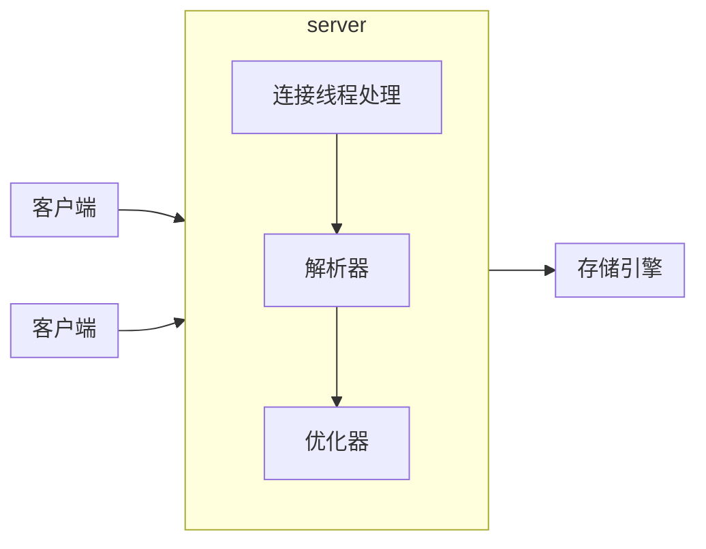
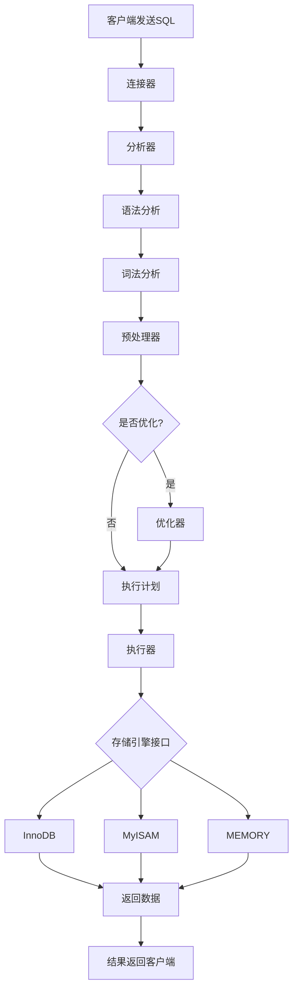
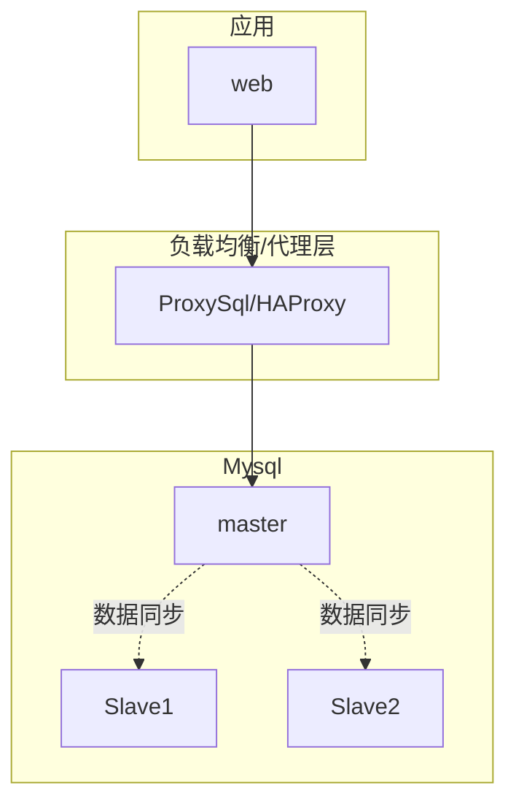

## 第一部分：MySQL 基础知识
### 1. MySQL安装

#### Windowns

1. 在下载的mysql压缩包解压后的根目录创建文件`my.ini`,并添加以下配置

```
[mysqld]
#设置3306端口
port=3306
#设置mysql的安装目录
basedir=D:\\software\\mysql-8.0.34-winx64
#设置mysql数据库的数据的存放目录
datadir=D:\\software\\mysql-8.0.34-winx64\\data
#允许最大连接数
max_connections=200
#允许连接失败的次数。
max_connect_errors=10
#服务端使用的字符集默认为utf8mb4
character-set-server=utf8mb4
#创建新表时将使用的默认存储引擎
default-storage-engine=INNODB
#默认使用“mysql_native_password”插件认证
#mysql_native_password
authentication_policy=*
[mysql]
#设置mysql客户端默认字符集
default-character-set=utf8mb4
# set 是字符集 collation是默认排序规则（比较大小、排序规则）
[client]
#设置mysql客户端连接服务端时默认使用的端口
port=3306
default-character-set=utf8mb4
```

2. 将解压后的bin文件夹添加到环境变量
3. 进入bin目录

```shell

# 进入bin目录
cd D:\mysql-8.0.37\bin

# 初始化（会生成随机root密码）
mysqld --initialize --console

# 初始化无root密码（仅用于开发环境）
mysqld --initialize-insecure --console

```

控制台会显示临时密码，例如：

```

[Note] [MY-010454] [Server] A temporary password is generated for root@localhost: Abc123!@#

```

4. 安装mysql服务

```shell

# 安装服务
mysqld --install mysql

# 或指定配置文件安装
mysqld --install mysql --defaults-file="D:\mysql-8.0.37\my.ini"

# 删除mysql服务
mysqld --remove mysql

# 打开服务
net start mysql

# 关闭服务
net stop mysql 


```

#### Linux（使用官方 MySQL Yum 仓库安装）

1. 下载官方仓库 RPM

```
sudo dnf install https://repo.mysql.com/mysql80-community-release-el8-7.noarch.rpm
```

注意：根据你的 AlmaLinux/RHEL 版本选择对应 RPM，例如 EL8、EL9。

2. 查看可用版本

```shell

dnf module list mysql
dnf repolist enabled | grep mysql

```

3. 安装 MySQL 服务端

```shell

sudo dnf install mysql-community-server -y

```

4. 启动 MySQL 并设置开机自启

```shell

sudo systemctl enable --now mysqld
sudo systemctl status mysqld

```

5. 获取初始 root 密码

官方 MySQL 安装会在 `/var/log/mysqld.log` 中生成临时密码：

```shell

sudo grep 'temporary password' /var/log/mysqld.log

```

然后执行：

```shell

-- 安全初始化
# 修改 root 密码
# 移除匿名用户
# 禁止远程 root 登录
# 删除测试数据库
sudo mysql_secure_installation

```

### 2. MySQL 整体架构


> 逻辑架构

最上层的客户端所包含的服务并不是MySQL独有的，大多数基于网络的客户端/服务器工具或服务器都有类似的服务，包括连接处理、身份验证、确保安全性等。

server是比较有意思的部分。大多数MySQL的核心功能都在这一层，包括查询解析、分析、优化、以及所有的内置函数（例如，日期、时间、数学和加密函数）​，所有跨存储引擎的功能也都在这一层实现：存储过程、触发器、视图等。

存储引擎负责MySQL中数据的存储和提取。和GNU/Linux下的各种文件系统一样，每种存储引擎都有其优势和劣势。服务器通过存储引擎API进行通信。这些API屏蔽了不同存储引擎之间的差异，使得它们对上面的查询层基本上是透明的。存储引擎层还包含几十个底层函数，用于执行诸如“开始一个事务”或者“根据主键提取一行记录”等操作。但存储引擎不会去解析SQL（InnoDB是例外它会解析mysql服务端没有的外键定义），不同存储引擎之间也不会相互通信，而只是简单地响应服务器的请求。

> 连接管理与安全性

默认情况下，每个客户端连接都会在服务器进程中拥有一个线程，该连接的查询只会在这个单独的线程中执行，该线程驻留在一个内核或者CPU上。服务器维护了一个缓存区，用于存放已就绪的线程，因此不需要为每个新的连接创建或者销毁线程。

当客户端（应用）连接到MySQL服务器时，服务器需要对其进行身份验证。身份验证基于用户名、发起的主机名和密码。如果以跨传输层安全(TLS)的方式连接，还可以使用X.509证书认证。客户端连接成功后，服务器会继续验证该客户端是否具有其发出的每个查询的权限（例如，是否允许客户端对world数据库中的Country表执行SELECT语句）​。

> 优化与执行

MySQL解析查询以创建内部数据结构（解析树）​，然后对其进行各种优化，包括重写查询、决定表的读取顺序，以及选择合适的索引等。用户可以通过特殊关键字向优化器传递提示，从而影响优化器的决策过程。也可以请求服务器解释优化过程的各个方面，使用户可以知道服务器是如何进行优化决策的，并提供一个参考点，便于用户重构查询和schema、修改相关配置，使应用尽可能高效地运行。

优化器并不关心表使用的是什么存储引擎，但存储引擎对于查询优化是有影响的。优化器会向存储引擎询问它的一些功能、某个具体操作的成本，以及表数据的统计信息。


#### 常见存储引擎对比（InnoDB / MyISAM / Memory）

| 特性       | InnoDB       | MyISAM  | MEMORY (HEAP) |
| -------- | ------------ | ------- | ------------- |
| **事务支持** | ✅ ACID 事务    | ❌ 不支持   | ❌ 不支持         |
| **行级锁**  | ✅ 支持         | ❌ 表级锁   | ✅ 支持          |
| **外键约束** | ✅ 支持         | ❌ 不支持   | ❌ 不支持         |
| **MVCC** | ✅ 多版本并发控制    | ❌ 不支持   | ❌ 不支持         |
| **崩溃恢复** | ✅ 自动恢复       | ❌ 需手动修复 | ❌ 数据丢失        |
| **全文索引** | ✅ MySQL 5.6+ | ✅ 支持    | ❌ 不支持         |
| **空间索引** | ✅ MySQL 5.7+ | ✅ 支持    | ❌ 不支持         |
| **数据压缩** | ✅ 支持         | ✅ 支持    | ❌ 不支持         |
| **存储限制** | 64TB         | 256TB   | 受内存限制         |
| **默认引擎** | ✅ MySQL 5.5+ | ❌ 以前默认  | ❌             |
#### 执行流程



1. 连接阶段

```mysql

-- 客户端发起连接
mysql -h127.0.0.1 -P3306 -uroot -p

-- MySQL 连接处理流程
1. 验证用户名密码
2. 检查权限
3. 建立连接线程
4. 分配连接资源

-- 查看连接信息
SHOW PROCESSLIST;
/*
+----+------+-----------+------+---------+------+-------+------------------+
| Id | User | Host      | db   | Command | Time | State | Info             |
+----+------+-----------+------+---------+------+-------+------------------+
|  5 | root | localhost | test | Query   |    0 | init  | show processlist |
+----+------+-----------+------+---------+------+-------+------------------+
*/
```

2. 分析器（Parser）词法分析

```mysql

-- 原始SQL：
SELECT id, name FROM users WHERE age > 18;

-- 词法分析结果：
Tokens: [
    {type: 'KEYWORD', value: 'SELECT'},
    {type: 'IDENTIFIER', value: 'id'},
    {type: 'COMMA', value: ','},
    {type: 'IDENTIFIER', value: 'name'},
    {type: 'KEYWORD', value: 'FROM'},
    {type: 'IDENTIFIER', value: 'users'},
    {type: 'KEYWORD', value: 'WHERE'},
    {type: 'IDENTIFIER', value: 'age'},
    {type: 'OPERATOR', value: '>'},
    {type: 'NUMBER', value: '18'}
]
```

3. 语法分析（生成AST）

```mysql

-- 生成抽象语法树（Abstract Syntax Tree）
AST Structure:
SELECT
├── columns
│   ├── id
│   └── name
├── FROM users
└── WHERE
    └── condition
        ├── age
        ├── >
        └── 18

-- 语法错误示例
SELECT * FORM users;  -- 错误：FORM 应该是 FROM
-- ERROR 1064 (42000): You have an error in your SQL syntax
```

4. 预处理器（Preprocessor）语义检查

```mysql

-- 检查项：
-- 1. 表和列是否存在
SELECT * FROM non_existent_table;  
-- ERROR 1146 (42S02): Table 'test.non_existent_table' doesn't exist

-- 2. 列名是否歧义
SELECT id FROM users, orders;  
-- ERROR 1052 (23000): Column 'id' in field list is ambiguous

-- 3. 权限检查
-- 用户是否有权访问该表

-- 4. 展开通配符 *
SELECT * FROM users;
-- 展开为所有列名：SELECT id, name, age, email FROM users;

```
5. 优化器执行的任务

```mysql

-- 1. 选择最优执行计划
EXPLAIN SELECT * FROM users WHERE age > 18 AND name LIKE 'J%';
-- 2. 优化决策点
-- a. 使用哪个索引
-- b. 多表连接的顺序
-- c. 是否使用覆盖索引
-- d. 是否下推条件
-- e. 是否使用临时表
```

> 优化器统计信息

```mysql

-- 查看表统计信息
SHOW TABLE STATUS LIKE 'users';
/*
+-------+--------+---------+------------+------+----------------+-------------+
| Name  | Engine | Version | Row_format | Rows | Avg_row_length | Data_length |
+-------+--------+---------+------------+------+----------------+-------------+
| users | InnoDB |      10 | Dynamic    | 1000 |             50 |       50000 |
+-------+--------+---------+------------+------+----------------+-------------+
*/

-- 更新统计信息
ANALYZE TABLE users;

-- 查看索引统计信息
SHOW INDEX FROM users;
```

6. 执行流程

```mysql

-- 1. 检查权限
-- 执行前再次验证用户是否有执行权限

-- 2. 调用存储引擎接口
-- 以 SELECT * FROM users WHERE id = 1; 为例：

-- 执行器工作流程：
-- 阶段1：准备阶段
--   1. 打开表 users
--   2. 获取元数据
--   3. 验证列存在性

-- 阶段2：执行阶段
--   1. 调用存储引擎的"读第一行"接口
--   2. 判断 WHERE 条件 id = 1 是否满足
--   3. 满足则放入结果集
--   4. 调用"读下一行"接口
--   5. 循环直到没有更多行

-- 阶段3：清理阶段
--   1. 关闭表
--   2. 清理临时资源

-- SELECT 查询
SELECT * FROM users WHERE age > 18;
/*
执行器步骤：
1. 打开 users 表
2. 调用存储引擎接口读取第一行
3. 检查 age > 18 条件
4. 符合条件的行加入结果集
5. 继续读取下一行直到结束
6. 返回结果集给客户端
*/

-- UPDATE 更新
UPDATE users SET status = 1 WHERE age > 18;
/*
执行器步骤：
1. 打开 users 表
2. 读取满足 age > 18 的所有行
3. 对每一行：
   a. 记录 undo log（用于回滚）
   b. 修改内存中的数据页
   c. 记录 redo log（用于崩溃恢复）
4. 提交事务
*/

-- INSERT 插入
INSERT INTO users (name, age) VALUES ('John', 25);
/*
执行器步骤：
1. 检查唯一性约束
2. 分配新的行ID（如果是自增）
3. 写入数据页
4. 更新索引
5. 记录 redo log
*/


```

7. InnoDB 执行流程

```mysql

-- InnoDB 读取数据流程
-- 以 SELECT * FROM users WHERE id = 1; 为例：

-- 1. 检查 Buffer Pool（内存缓存）
--   - 如果数据页在 Buffer Pool 中，直接返回
--   - 如果不在，从磁盘读取到 Buffer Pool

-- 2. 索引查找（使用 B+ 树）
--   - 从根节点开始
--   - 逐层比较，找到叶子节点
--   - 读取数据行

-- 3. 返回给执行器

-- Buffer Pool 结构
SHOW ENGINE INNODB STATUS\G
-- 查看 BUFFER POOL AND MEMORY 部分
```

> 读写操作对比

```
-- 读操作路径（SELECT）
客户端 → 连接器 → 分析器 → 优化器 → 执行器 → InnoDB
                                      ↓
                                Buffer Pool（内存）
                                      ↓
                                    磁盘（如需要）

-- 写操作路径（INSERT/UPDATE/DELETE）
客户端 → 连接器 → 分析器 → 优化器 → 执行器 → InnoDB
                                      ↓
                                写 Redo Log（顺序写）
                                      ↓
                              修改 Buffer Pool（内存）
                                      ↓
                              后台线程刷盘到表空间
```

8. 结果集处理

```mysql

-- 结果返回方式
-- 1. 立即返回（小结果集）
SELECT * FROM users LIMIT 10;
-- 全部数据计算完成后一次性返回

-- 2. 流式返回（大结果集）
SELECT * FROM large_table;
-- 边执行边返回，使用游标
-- 客户端可以逐行处理

-- 3. 网络传输
-- 结果序列化 → 网络传输 → 客户端反序列化

-- 查看返回状态
SHOW SESSION STATUS LIKE 'Last_query_cost';
-- 显示上次查询的优化器估算成本
```

> 复杂查询执行路径

```mysql

-- 查询：查找购买了特定产品的用户
EXPLAIN 
SELECT u.name, u.email, p.product_name, o.quantity
FROM users u
JOIN orders o ON u.id = o.user_id
JOIN products p ON o.product_id = p.id
WHERE p.category = 'Electronics'
AND o.order_date >= '2024-01-01'
ORDER BY o.order_date DESC
LIMIT 100;

-- 执行路径分解：
-- 阶段1：连接建立（5ms）
-- 阶段2：语法分析（2ms）
-- 阶段3：优化器决策（10ms）选择驱动表（主驱动表） 目的是减少扫描行数。
--   1. 决定连接顺序：products → orders → users
--   2. 选择索引：使用 p.category 索引 
--   3. 估算成本：~1000行
-- 阶段4：执行（50ms）
--   1. 读取 products 表（使用索引）
--   2. 读取 orders 表（连接 products）
--   3. 读取 users 表（连接 orders）
--   4. 排序结果
--   5. 应用 LIMIT
-- 阶段5：返回结果（5ms）
-- 总耗时：~72ms
```

> 逻辑上

MySQL 的执行顺序和 SQL 写法顺序不完全一样，逻辑上大致如下：

1. **FROM + JOIN**
    
    - 首先确定参与查询的表和连接方式。
        
    - 选择表的访问顺序（join order），可能基于优化器估算的基数（cardinality）。
        
    - 初步组合行：从 `users`、`orders` 和 `products` 中生成候选组合。
        
2. **ON 条件**
    
    - 对 JOIN 的每一行应用连接条件：
        
        - `u.id = o.user_id`
            
        - `o.product_id = p.id`
            
3. **WHERE 条件过滤**
    
    - 对 JOIN 结果应用过滤条件：
        
        - `p.category = 'Electronics'`
            
        - `o.order_date >= '2024-01-01'`
            
4. **SELECT 列选择**
    
    - 选择需要返回的列：`u.name, u.email, p.product_name, o.quantity`
        
5. **ORDER BY 排序**
    
    - 根据 `o.order_date DESC` 对结果排序。
        
    - 如果有索引可以利用（如 `orders(order_date)`），MySQL 可能在扫描时就做排序，减少排序开销。
        
6. **LIMIT 行数**
    
    - 最后限制返回前 100 行。

> 物理上

假设 InnoDB 存储引擎，优化器选择了合理的索引：

1. **选择驱动表（主驱动表）**
    
    - 可能从 `products` 表开始（因为 `category` 有选择性高的索引），或者从 `orders` 开始（有 `order_date` 索引）。
        
    - 目的是减少扫描行数。
        
2. **扫描并使用索引**
    
    - `products` 表按 `category` 索引查出 Electronics 类别的产品。
        
    - 对每个匹配的产品，查找 `orders` 表中 `product_id` 对应行（利用 `orders.product_id` 索引）。
        
    - 对每个匹配的订单，再查找 `users` 表中 `id` 对应行（利用 `users.id` 主键索引）。
        
3. **连接操作**
    
    - 内部可能使用 **索引嵌套循环（Index Nested Loop Join）**：
        
        - 外层表：products / orders
            
        - 内层表：orders / users
            
        - 使用索引快速定位对应行
            
4. **过滤条件应用**
    
    - 对每一行应用 `WHERE` 中剩余条件：
        
        - `o.order_date >= '2024-01-01'`
            
5. **排序**
    
    - 如果 `orders(order_date)` 有索引，可以利用索引扫描顺序完成排序
        
    - 否则，需要临时表排序（filesort）
        
6. **返回前 100 行**
    
    - 使用 `LIMIT 100` 截断，避免扫描过多不必要行（优化器可能会提前停止扫描 if possible）

### 3. SQL 基础与执行逻辑

#### 登录

```shell

# 回车后输入临时密码
mysql -uroot -p
mysql -h 地址 -P 端口 -u 用户名 -p 密码

```

#### 数据定义语言(DDL)

DDL全称是Data Definition Language，即数据定义语言，定义语言就是定义关系模式、删除关系、修改关系模式以及创建数据库中的各种对象，比如表、聚簇、索引、视图、函数、存储过程和触发器等等。

数据定义语言是由SQL语言集中负责数据结构定义与数据库对象定义的语言，并且由CREATE、ALTER、DROP和TRUNCATE四个语法组成。

> 创建表

```mysql

-- 创建表,并且添加主键约束,和外键约束
create table 表名(
	`字段名` 类型名(大小) 约束,
	primary key(`字段名`),
	foreign key(`字段名`) references 表名(`字段名`)
)engine = innodb default charset = utf8
-- 删除表
drop table 表名;
-- 展示表的结构
desc(describe) 表名;

```

> 修改表结构

`rename`: 可以用来修改表的名称

`change`:关键字可以修改表的字段的名称,能修改表的类型

`modify`:关键字可以修改表的字段类型,但不能修改字段的名称

```mysql

-- 重命名表(数据库不重命名)
alter table `旧名字` rename `新名字`;
-- 字段类型的修改
alter table `表名` modify `字段名` 字段类型(int(10));
-- 字段名的修改(change) 
alter table  `表名` change  `字段名` `新名字` 字段类型(int(10));

-- 添加字段
alter table `表名` add `字段名` `字段类型` [first/last/after `字段名`];
-- 添加主键约束
alter table `表名` add primary key(字段);

```

```mysql
# 修改密码
alter user 'root'@'localhost' identified by '1234';
FLUSH PRIVILEGES;
```

#### 数据操作语言(DML)

数据操纵语言全程是Data Manipulation Language，主要是进行插入元组、删除元组、修改元组的操作。主要有insert、update、delete语法组成。

> 表数据的增删查改

```mysql

-- 插入语句
insert into `表名` values ("","",0),("","",0);
insert into `表名`(字段,字段,字段) values ("","",0),("","",0);

-- 查询语句
select * from `表名` where 条件表达式 group by 字段 having 条件表达式 order by 字段 [asc/desc];
-- 查询全部信息并去重
select distinct * from `表名`;

-- 更新语句
update `表名` set 字段=数值 where 条件表达式;

-- 删除语句
delete from `表名` where 条件表达式; -- delete 使用后自增索引可能会出问题
truncate table `表名`;  -- 删除表重新创建,清空全部数据

```

#### 数据查询语言(DQL)

数据查询语言全称是Data Query Language，所以是用来进行数据库中数据的查询的，即最常用的select语句

SELECT 执行顺序（FROM → WHERE → GROUP BY → HAVING → SELECT → ORDER BY → LIMIT）

#### 事务控制语言(DCL)

数据控制语言：Data Control Language。用来授权或回收访问数据库的某种特权，并控制数据库操纵事务发生的时间及效果，能够对数据库进行监视。

比如常见的授权、取消授权、回滚、提交等等操作。

### 4. 数据类型与存储成本

#### 整数类型

（TINYINT / INT / BIGINT / UNSIGNED）

#### 实数类型

实数是带有小数部分的数字。然而，它们不仅适用于带小数的数字，也可以使用DECIMAL存储比BIGINT还大的整数。MySQL既支持精确类型，也支持不精确类型。

由于额外的空间需求和计算成本，应该尽量只在对小数进行精确计算时才使用DECIMAL——例如，存储财务数据。但在一些大容量的场景，可以考虑使用BIGINT代替DECIMAL，将需要存储的货币单位根据小数的位数乘以相应的倍数即可。假设要存储财务数据并精确到万分之一分，则可以把所有金额乘以一百万，然后将结果存储在BIGINT里，这样可以同时避免浮点存储计算不精确和DECIMAL精确计算代价高的问题。

#### 字符串类型

MySQL支持多种字符串数据类型，每种类型还有许多变体。每个字符串列可以有自己的字符集和该字符集的排序规则集。

VARCHAR和CHAR是两种最主要的字符串类型。不幸的是，很难精确地解释这些值是如何存储在磁盘和内存中的，因为这跟存储引擎的具体实现有关。下面的描述假设使用的存储引擎是InnoDB。如果不是InnoDB，请参考所使用的存储引擎的文档。

存储引擎在内存中存储CHAR或VARCHAR值的方式可能与在磁盘上存储该值的方式不同，并且服务器在从存储引擎检索该值时可能会将其转换为另一种存储格式。

> VARCHAR

VARCHAR用于存储可变长度的字符串，是最常见的字符串数据类型。它比固定长度的类型更节省空间，因为它仅使用必要的空间（即，更少的空间用于存储更短的值）​。

VARCHAR需要额外使用1或2字节记录字符串的长度：如果列的最大长度小于或等于255字节，则只使用1字节表示，否则使用2字节。假设采用latin1字符集，一个VARCHAR(10)的列需要11字节的存储空间。VARCHAR(1000)的列则需要1002个字节，因为需要2字节存储长度信息。

VARCHAR节省了存储空间，所以对性能也有帮助。但是，由于行是可变长度的，在更新时可能会增长，这会导致额外的工作。如果行的增长使得原位置无法容纳更多内容，则处理行为取决于所使用的存储引擎。例如，InnoDB可能需要分割页面来容纳行。其他一些存储引擎也许不在原数据位置更新数据。

下面这些情况使用VARCHAR是合适的：字符串列的最大长度远大于平均长度；列的更新很少，所以碎片不是问题；使用了像UTF-8这样复杂的字符集，每个字符都使用不同的字节数进行存储。unicode字符表达的字符字节数不固定，不适合使用char

> CHAR

CHAR是固定长度的：MySQL总是为定义的字符串长度分配足够的空间。当存储CHAR值时，MySQL删除所有尾随空格。如果需要进行比较，值会用空格填充。

- **存储时**：CHAR 会自动用空格填充到指定长度
    
- **比较时**：**尾随空格通常被忽略**
    
- **检索时**：默认去掉尾随空格显示（除非特定设置）

CHAR适合存储非常短的字符串，或者适用于所有值的长度都几乎相同的情况。例如，对于用户密码的MD5值，CHAR是一个很好的选择，它们的长度总是相同的。对于经常修改的数据，CHAR也比VARCHAR更好，因为固定长度的行不容易出现碎片。对于非常短的列，CHAR也比VARCHAR更高效；设计为只保存Y和N的值的CHAR(1)在单字节字符集中只使用1字节，但VARCHAR(1)需要2字节，因为还有一个记录长度的额外字节。

> BLOB和TEXT类型

BLOB和TEXT都是为存储很大的数据而设计的字符串数据类型，分别采用二进制和字符方式存储。

当BLOB和TEXT值太大时，InnoDB会使用独立的“外部”存储区域，此时每个值在行内需要1～4字节的存储空间，然后在外部存储区域需要足够的空间来存储实际的值。

BLOB和TEXT家族之间的唯一区别是，BLOB类型存储的是二进制数据，没有排序规则或字符集，但TEXT类型有字符集和排序规则。

MySQL不能将BLOB和TEXT数据类型的完整字符串放入索引，也不能使用索引进行排序。

#### 时间类型

> DATETIME

这种类型可以保存大范围的数值，从1000年到9999年，精度为1微秒。它以YYYYMMDDHHMMSS格式存储压缩成整数的日期和时间，且与时区无关。这需要8字节的存储空间。

默认情况下，MySQL以可排序、无歧义的格式显示DATETIME值，例如，2008-01-16 22：37：08。这是ANSI表示日期和时间的标准方式。

> TIMESTAMP

TIMESTAMP类型存储自1970年1月1日格林尼治标准时间(GMT)午夜以来经过的秒数——与UNIX时间戳相同。TIMESTAMP只使用4字节的存储空间，所以它的范围比DATETIME小得多：只能表示从1970年到2038年1月19日。

TIMESTAMP存的是秒数，所有当你数据库的时区变化的后，它可以根据你的时区去计算出对应当前时区的时间，而DATETIME不会，它存的是固定格式的时间，无论你切换什么时区，都是这样显示。

### 5. 表结构与范式


---

## 第二部分：事务与并发控制

### 5. 事务基础

- ACID 含义与现实权衡
    
- 自动提交（autocommit）机制
    
- 隐式提交场景
    

### 6. 隔离级别与并发问题

#### 隔离级别 & 事务可见性

| 隔离级别               | 主要特性                                  | 可能读现象             | 典型查询示例                                                |
| ------------------ | ------------------------------------- | ----------------- | ----------------------------------------------------- |
| `READ UNCOMMITTED` | 最低隔离，**不做任何加锁**                       | _脏读_、_不可重复读_、_幻读_ | `SELECT …`                                            |
| `READ COMMITTED`   | 每条语句只看已提交的事务                          | _不可重复读_、_幻读_      | `SELECT …` (单条语句)                                     |
| `REPEATABLE READ`  | 默认级别，使用 **MVCC + next‑key lock** 防止幻读 | _不发生幻读_           | `SELECT … FOR UPDATE` / `SELECT …` (WITH SNAPSHOT)    |
| `SERIALIZABLE`     | 最高级别，使用 **行锁 + gap lock** 等保证完全串行     | 无幻读、无脏读           | `SELECT … LOCK IN SHARE MODE` / `SELECT … FOR UPDATE` |
**MVCC**（多版本并发控制）保持历史版本，读不加锁；写会加行锁。  
幻读是 _新行被插入导致相同范围查询返回更多行_ 的现象。

#### 脏读 / 不可重复读 / 幻读

这三种“读异常”（_read anomalies_）是 **事务隔离级别** 的核心概念。  
在并发环境下，事务看到的数据如果不是自己 **提交前** 的版本，就会产生这些异常。

|异常|简单定义|触发条件|典型示例（MySQL）|
|---|---|---|---|
|**脏读 (Dirty Read)**|读取了**未提交**事务写入的数据。|事务 A 写数据 → 事务 B 读取 → 事务 A 回滚|A: `INSERT …`  <br>B: `SELECT …`（把 A 的插入值读到）|
|**不可重复读 (Non‑Repeatable Read)**|同一事务中多次读取同一行，**读到不同值**（因为另一个事务修改并提交）。|事务 A 读 → 事务 B 更新相同行并提交 → 事务 A 再读|A: `SELECT …`  <br>B: `UPDATE …`  <br>A: `SELECT …`|
|**幻读 (Phantom Read)**|同一事务多次查询同一范围，**出现/消失了行**（因为另一个事务插入或删除了满足条件的行）。|事务 A 读 range → 事务 B 插入/删除行并提交 → 事务 A 再读|A: `SELECT * FROM t WHERE age>30`  <br>B: `INSERT…` or `DELETE …`  <br>A: `SELECT * FROM t WHERE age>30`|
> 脏读 (Dirty Read)

|事务 A|事务 B|
|---|---|
|`START TRANSACTION;`  <br>`INSERT INTO t (id, val) VALUES (1, 'dirty');`|`START TRANSACTION;`  <br>`SELECT val FROM t WHERE id=1;`|
|(没有 `COMMIT`)|① 看到 `'dirty'`  <br>② 若 A `ROLLBACK`，B 的读取数据就是 **不存在** 的 **脏** 记录。|

**隔离级别**  
只有 `READ UNCOMMITTED`;  
其余级别（`READ COMMITTED`、`REPEATABLE READ`、`SERIALIZABLE`）**不会**出现脏读。

---

> 不可重复读 (Non‑Repeatable Read)

|事务 A|事务 B|
|---|---|
|`START TRANSACTION;`  <br>`SELECT val FROM t WHERE id=1;`  <br>(假设值为 `'old'`)|`START TRANSACTION;`  <br>`UPDATE t SET val='new' WHERE id=1;`  <br>`COMMIT;`|
|再次 `SELECT val FROM t WHERE id=1;`  <br>结果为 `'new'` —— **第一次** 和 **第二次** 读取结果不同。||

**隔离级别**  
① `READ UNCOMMITTED` & `READ COMMITTED` 支持不可重复读。  
② `REPEATABLE READ` 和 `SERIALIZABLE` 能保证 **同事务内的查询结果不变**（使用 **快照** 或 **gap lock**）。

---

> 幻读 (Phantom Read)

| 事务 A                                                                            | 事务 B                                                                                             |
| ------------------------------------------------------------------------------- | ------------------------------------------------------------------------------------------------ |
| `START TRANSACTION;`  <br>`SELECT COUNT(*) FROM t WHERE age > 30;`  <br>(假设为 5) | `START TRANSACTION;`  <br>`INSERT INTO t (id, age, val) VALUES (100, 35, 'new');`  <br>`COMMIT;` |
| 再次 `SELECT COUNT(*) FROM t WHERE age > 30;`  <br>结果变为 6 —— 除了现有行，“**幻**”出现了新行。  |                                                                                                  |

**隔离级别**  
① `READ UNCOMMITTED`、`READ COMMITTED`、`REPEATABLE READ` 都可能触发幻读。  
② 仅 `SERIALIZABLE` 使用 **gap lock** 防止新行插入，从而消除幻读。

---

> 如何预防

|目标|方案|
|---|---|
|防止脏读|使用 `READ COMMITTED` 或更高级别|
|防止不可重复读|`REPEATABLE READ` 或 **使用快照读**（`SELECT … LOCK IN SHARE MODE`）|
|防止幻读|`SERIALIZABLE`，或在 `REPEATABLE READ` 下 **加显式行锁**（`SELECT … FOR UPDATE`）|

**注意**：

- `REPEATABLE READ` 默认已对**主键**等覆盖范围使用 **gap lock**，可以阻止 _幻读_，但如果你只用非聚集索引查询，还是可能出现幻读。
- 写入时尽可能使用 **最小范围的锁**：避免全表或长行锁。

---

>  **具体代码演示**

```
-- 假设存在表 t(id INT PK, val VARCHAR(20))
```

**脏读（READ UNCOMMITTED）**

```
-- 事务 A
START TRANSACTION;
INSERT INTO t VALUES (1,'bad');
-- 事务 B
SET TRANSACTION ISOLATION LEVEL READ UNCOMMITTED;
START TRANSACTION;
SELECT val FROM t WHERE id=1;   -- 返回 'bad'
ROLLBACK;  -- A 回滚，B 读到的值不应该存在
```

**不可重复读（READ COMMITTED）**

```
-- 事务 A
SET TRANSACTION ISOLATION LEVEL READ COMMITTED;
START TRANSACTION;
SELECT val FROM t WHERE id=1;   -- 'old'
COMMIT;

-- 事务 B
START TRANSACTION;
UPDATE t SET val='new' WHERE id=1;
COMMIT;

-- 事务 A 再次查询
SET TRANSACTION ISOLATION LEVEL READ COMMITTED;
START TRANSACTION;
SELECT val FROM t WHERE id=1;   -- 'new' → 不可重复读
COMMIT;
```

**幻读（SERIALIZABLE）**

```
-- 事务 A
SET TRANSACTION ISOLATION LEVEL SERIALIZABLE;
START TRANSACTION;
SELECT COUNT(*) FROM t WHERE age > 30;  -- 5
COMMIT;

-- 事务 B 插入新行
SET TRANSACTION ISOLATION LEVEL SERIALIZABLE;  -- 也是为了演示
START TRANSACTION;
INSERT INTO t (id, age, val) VALUES (999, 35, 'new');
COMMIT;

-- 事务 A 再次查询
SET TRANSACTION ISOLATION LEVEL SERIALIZABLE;
START TRANSACTION;
SELECT COUNT(*) FROM t WHERE age > 30;  -- 仍为 5，幻读被防止
COMMIT;
```

---

#### 小结

|异常|需要避免的隔离级别|典型防护手段|
|---|---|---|
|脏读|任何级别都可能|`READ COMMITTED` 起步|
|不可重复读|`READ UNCOMMITTED`、`READ COMMITTED`|`REPEATABLE READ` 或显式锁|
|幻读|所有级别 ≠ `SERIALIZABLE`|`SERIALIZABLE`，或使用显式行/范围锁|

**核心思路**：  
读异常的产生与 **数据修改** 的并发、**事务的隔离级别**、以及 **锁机制** 三者密切相关。  
根据业务需求权衡事务隔离（一致性 vs 并发），并在代码层面加锁或使用更高级别，才能获得预期的事务语义。


### 7. 锁机制概览

#### InnoDB 锁的种类

| 锁类型                   | 触发语句                          | 保护范围       | 作用          | 典型场景                             |
| --------------------- | ----------------------------- | ---------- | ----------- | -------------------------------- |
| **共享锁 (S)**           | `SELECT … LOCK IN SHARE MODE` | 行          | 允许读，但不允许写   | 读并发                              |
| **排他锁 (X)**           | `SELECT … FOR UPDATE`         | 行          | 阻止其他事务读写    | 更新前锁行                            |
| **记录锁 (Record Lock)** | 写、行锁                          | 行          | 只锁住记录       | 插入、更新                            |
| **Gap Lock**          | 等值查询（`=`）或排序                  | 索引键值 _gap_ | 防止幻读        | `SELECT … WHERE id = 5` (id 不存在) |
| **Next‑Key Lock**     | **Gap Lock + Record Lock**    | 键区间起止点     | 防止插入冲突 & 幻读 | 任何范围查询                           |
| **Auto‑inc Lock**     | 插入自增主键                        | 自增列        | 防止自增冲突      | `INSERT … AUTO_INCREMENT`        |
| **Table‑level Lock**  | `LOCK TABLES …`               | 表          | 适用于DDL或极端并发 | `CREATE TABLE`                   |
**Gap Lock + Record Lock** 组合得到 _Next‑Key Lock_，是 InnoDB 防止幻读的核心手段。

#### Gap vs Next‑Key

- **Gap Lock** 只锁住两键之间的 _空隙_，不锁实际记录。  
    示例：查询 `WHERE id = 5` 且 `id` 不存在 → 锁住 `(4,6)` 区间的 gap。
- **Next‑Key Lock** 其实是 _Gap Lock + Record Lock_ 的合体。  
    如果记录存在，锁住该记录 + 前一个键到该键的 gap，形成 _锁定区间_。

---

#### 索引的类型与对锁的影响

|索引类型|说明|对锁的影响|常见用法示例|
|---|---|---|---|
|**主键 (PRIMARY KEY)**|唯一、聚集索引|写操作会产生 **Record Lock** + **Gap Lock**（区间）|`PRIMARY KEY (id)`|
|**唯一索引 (UNIQUE)**|唯一、聚集或非聚集|写时会锁对应记录 + gap|`UNIQUE (email)`|
|**非聚集索引 (INDEX)**|仅存索引键|写时只锁 **记录+gap**，不锁聚集键|`INDEX (name)`|
|**全文索引 (FULLTEXT)**|适用于文本搜索|通过 _全文搜索引擎_ 进行，在 InnoDB 4.0 以后可使用|`FULLTEXT (content)`|
|**空间索引 (SPATIAL)**|用作地理位置|只影响空间字段|`SPATIAL INDEX (loc)`|
|**位图索引 (BITMAP)**|低占用空间，读多写少|适用于稀疏字段|—|
|**列式存储索引 (HASH, BRIN)**|仅在 PostgreSQL 或 MariaDB|对 InnoDB 无直接影响|—|

**聚集索引**：数据行存储在 B‑Tree 叶子节点。  
**非聚集索引**：仅存索引键加原表行键的指针。  
**锁粒度**：写主键索引会加 _锁到 key 值_，写非聚集索引只锁 _index entry_。

---

#### 锁 + 索引 + 隔离级别的协作实例

假设有表 `orders`：

```
CREATE TABLE orders (
    order_id      BINARY(16) PRIMARY KEY      -- UUID 主键
  , customer_id   INT
  , status        VARCHAR(20)
  , updated_at    DATETIME(6) DEFAULT CURRENT_TIMESTAMP(6)
      ON UPDATE CURRENT_TIMESTAMP(6)
) ENGINE=InnoDB;
```

#### 幻读：`REPEATABLE READ` → **Next‑Key Lock**

```
-- 事务 A (在 REPEATABLE READ 下)
START TRANSACTION;
SELECT * FROM orders WHERE order_id = UNHEX('0000000000000000') /* 不存在 */
-- 产生：Gap Lock on (order_id < gap < next_key_start) + X lock

-- 事务 B (尝试插入相同主键)
INSERT INTO orders (order_id, customer_id, status) VALUES (UNHEX('0000000000000000'), 10, 'NEW');
-- B 会等待 A（因为 A 的 Next‑Key Lock 在同一 gap）

COMMIT;  -- A 提交后 B 可以继续
```

#### 自增主键的 **Auto‑inc Lock**

```
CREATE TABLE seq(
  id INT AUTO_INCREMENT PRIMARY KEY
) ENGINE=InnoDB;

INSERT INTO seq VALUES ();   -- 把锁加到 auto_inc lock
```

#### Gap Lock 的“无痕”锁定

假设主键是 `INT` 并且 `id` 只插入到 1000 之后：

```
SELECT * FROM seq WHERE id = 5000;   -- id 不存在
-- 产生: Gap Lock on (5000-? )   (大范围未被覆盖的空隙)
```

此锁会阻止任何插入在 5000 之前出现新行。

---

#### 性能贴士

|场景|建议|说明|
|---|---|---|
|**高并发插入**|1. 使用 **自增主键** 或基于时间的 UUID `<` （减少 gap 大小）  <br>2. 设定 `innodb_autoinc_lock_mode=2`|避免全局 auto‑inc 锁|
|**大批量更新**|1. 先 `UPDATE … WHERE … LIMIT …` 并加 `ROW_NUMBER()` 分批|避免一次性全表锁|
|**查询频繁出现幻读**|1. 把查询放在 `SERIALIZABLE` 或加 `FOR UPDATE`|需要额外性能成本|
|**复杂索引查询**|1. 只建立必要的索引|索引多了写操作要加更多锁|
|**UUID 主键**|1. 采用 `UUID()` 或 `UUID_TO_BIN()`|更好支持 B‑Tree 排序，减少冲突|
|**长事务**|1. 逻辑拆分为小事务|缩短锁持有时间|

---

#### 小结

| 模块          | 关键点                                                                         |
| ----------- | --------------------------------------------------------------------------- |
| **隔离级别**    | 控制读的**可见性**，从脏读到完全串行。                                                       |
| **锁**       | InnoDB 通过 **共享/排他行锁**、**Gap**、**Next‑Key**、**Auto‑inc**、**表锁** 等多层级保护数据一致性。 |
| **索引**      | 聚集/非聚集决定锁的粒度；正确使用索引可让查询快且锁冲突少。                                              |
| **UUID 主键** | 随机会扩大 gap，导致 _gap lock_ 触发的并发瓶颈。                                            |
| **性能调优**    | 适时分区、自增锁模式、分批操作、最小化索引，都是减少锁争用的常用手段。                                         |

**操作提示**  
① 在查询前加 `EXPLAIN EXTENDED` 或 `SHOW WARNINGS` 可查看索引使用。  
② 可通过 `SHOW ENGINE INNODB STATUS\G` 检查当前锁等待情况。  
③ 生产环境建议在 `REPEATABLE READ` 下，必要时仅开启 `READ COMMITTED` 或 `SERIALIZABLE`。

---

## 第三部分：索引与数据组织（核心）

### 索引

> **索引的本质：用空间换时间，用有序结构减少磁盘 I/O 次数**

- 减少 **需要读取的 Page 数量**
    
- 将 **随机 I/O 转化为顺序 / 范围 I/O**
    
- 在 Buffer Pool 中提高 **命中率**
### 8. B+Tree 与索引基础

> 索引基础

要理解MySQL的索引原理，最简单的方法就是去看一本书的“索引”部分：如果想在一本书中找到某个特定主题，一般会先看书的索引，找到对应的页码。

索引有很多种类型，可以为不同的场景提供更好的性能。在MySQL中，索引是在存储引擎层而不是服务器层实现的。所以，并没有统一的索引标准：不同存储引擎的索引的工作方式并不一样，也不是所有的存储引擎都支持所有类型的索引。即使多个存储引擎支持同一种类型的索引，其底层的实现也可能不同。

> B+Tree索引

当人们谈论索引的时候，如果没有特别指明类型，那么多半说的是B-tree索引，它使用B-tree数据结构来存储数据。大多数MySQL引擎都支持这种索引。非叶子节点只存key, 不存数据。叶子节点存key+行定位信息。叶子节点通过双向链表按照主键顺序相连方便扫描。

使用索引查找数据的时，存储引擎不再需要进行全表扫描。而是从索引的根节点开始进行搜索，根节点的槽中存放了指向子节点的指针，存储引擎根据这些指针向下层查找。通过比较节点页的值和要查找的值可以找到合适的指针进入下层子节点，这些指针实际上定义了子节点页中值的上限和下限。最终存储引擎要么找到对应的值，要么该记录不存在。

根节点和叶子节点之间可能有很多层节点页。树的深度和表的大小直接相关。

B-tree是按照索引列中的数据大小顺序存储的，所以很适合按照范围来查询。

自适应哈希索引。InnoDB存储引擎有一个被称为自适应哈希索引的特性。当InnoDB发现某些索引值被非常频繁地被访问时，它会在原有的B-tree索引之上，在内存中再构建一个哈希索引。这就让B-tree索引也具备了一些哈希索引的优势，例如，可以实现非常快速的哈希查找。这个过程是完全自动化的，用户无法进行控制或者配置。不过，可以通过参数彻底关闭自适应哈希索引这个特性。

B-tree索引适用于全键值、键值范围或键前缀查找。其中键前缀查找只适用于根据最左前缀的查找。

> 匹配最左前列 

索引有多个数据列，当查找数据时可以用第一列的数据做查询条件，走索引，如果第一列内容相同，可以第二列走索引，如果查询中有某列的范围查询，则其右边所有列都无法使用索引优化查找。如果范围查询列值的数量有限，那么可以通过使用多个等于条件来代替范围条件。

如果不是按照索引的最左列开始查找，则无法使用索引。如索引是(col1,col2) col1 可以走索引

> 匹配最左前缀

可以只匹配某一列的值的开头部分。可用于查找所有姓以J开头的人。只使用了索引的第一列。

### 9. 聚簇索引（Clustered Index）

> **聚簇索引**：并不是一种单独的索引类型，而是一种数据存储方式。具体的细节依赖于其实现方式，但InnoDB的聚簇索引实际上在同一个结构中保存了B-tree索引和数据。索引的叶子节点就是数据行本身

在 InnoDB 中： 表的数据 **只能按一种方式组织**，这种组织方式就是 **聚簇索引**。因为无法同时把数据行存放在两个不同的地方，所以一个表只能有一个聚簇索引。


>**在Innodb表一定存在一个聚簇索引 聚簇索引的选择规则**

如果你没有定义`PRIMARY KEY`，InnoDB会选择一个唯一的`UNIQUE + NOT NULL`代替。如果没有这样的索引，InnoDB会隐式生成的 **6 字节 row_id**来作为聚簇索引。这样做的缺点在于，所有这些表的 INSERT，都要争抢 **同一个内部 mutex**，高并发写入时，容易出现 **严重锁竞争**。（多张“无主键表”，共享同一个 row_id 生成器）

| 项目     | 隐式 row_id    | AUTO_INCREMENT |
| ------ | ------------ | -------------- |
| 作用范围   | **实例级 / 全局** | **表级**         |
| 多表是否共享 | 是            | ❌ 否            |
| 热点集中程度 | 极高           | 相对可控           |
|        | 无法优化         | 有 lock mode 优化 |
   >**优缺点**

聚簇索引的优势本就绑定磁盘I/O优化。
- 磁盘场景：聚簇索引让数据物理连续，一次I/O能加载整页相关数据，大幅减少读写次数，对I/O密集型场景增益极大
- 内存场景：数据直接在内存寻址，无需依赖物理存储顺序，聚簇索引的连续存储优势直接失效，和普通索引访问效率几乎无差
补充2个实用点：
1. 内存足够时，聚簇索引的回表开销也会大幅降低，辅助索引性能也会跟着提升
2. 即便全内存，聚簇索引仍有微小优势（主键有序），但远不足以抵消它插入/更新时维护物理顺序的开销

插入速度严重依赖于插入顺序。按照主键的顺序插入行是将数据加载到InnoDB表中最快的方式。但如果不是按照主键的顺序加载数据，那么在加载完成后最好使用OPTIMIZE TABLE命令重新组织一下表。
更新聚簇索引列的代价很高，因为它会强制InnoDB将每个被更新的行移动到新的位置。
基于聚簇索引的表在插入新行，或者主键被更新导致需要移动行的时候，可能面临页分裂(page split)的问题。


### 10. 二级索引（Secondary Index）

聚簇索引将索引和数据保存在同一个B-tree中，因此从聚簇索引中获取数据通常比在非聚簇索引中查找要快。二级索引叶子节点存储内容 索引列值 + 主键值，所以搜索数据时，通常需要一次回表查询，先通过二级索引查找到主键值，在通过主键值去聚簇索引中查询所需列的值。

需要注意的是，`select id,name from t1 where name='zhangsan'` 表中id是主键，name是二级索引，这条查询不需要回表，因为二级索引中包含了id的值。
    


### 11. 全表扫描与索引扫描

**聚簇索引的全表扫描本质上是按主键顺序顺序遍历叶子页，通常是最高效的扫描方式。**  

但在频繁页分裂、删除或非顺序主键写入的情况下，频繁删除会导致数据页中有效行比例下降。  
由于 InnoDB 不会在日常运行中对聚簇索引进行全量物理重排，这些低利用率的数据页仍会被保留。  
在全表扫描时，需要读取更多的数据页才能扫描到同样数量的行，从而放大全表扫描的 I/O 成本，  
这在 Buffer Pool 不足或磁盘 I/O 敏感的场景下尤为明显。

### 12. 删除、更新与行稀疏问题

Innodb的删除时先逻辑删除删除标记位（delete flag），查询时：直接跳过 delete-marked 的记录就像它不存在一样。行仍然占据 Page 中的空间，Page 本身仍然是一个 **完整的 16KB 数据页**。
所以全表扫描时：不是在读“磁盘空白区域”，也不是跳过了有用数据，而是**读了很多“有效率很低的 Page”**，InnoDB **不会为了删除而主动移动行**，但在以下情况下会发生“局部整理”：页合并（merge），页重用，重建表（OPTIMIZE / ALTER）

|操作|是否解决|原因|
|---|---|---|
|DELETE|❌|只打标记|
|TRUNCATE|✅|直接重建|
|OPTIMIZE TABLE|✅|重建聚簇索引|
|ALTER TABLE ENGINE=InnoDB|✅|等价重建|
|INSERT 新数据|部分|可能复用空洞|
> 删除

InnoDB 删除一行时： 不会立刻物理移除，先进行逻辑删除, 行记录仍然留在数据页中，标记为 `delete-marked`。行仍然在聚簇索引的叶子节点，二级索引依然指向主键值。存储引擎检查时发现标志会跳过。当没有事务需要该旧版本，undo log 可回收purge 线程开始工作，从聚簇索引的叶子页中移除改行记录，回收行空间，page内空闲页增加，二级索引删除对应的索引记录。


### 13. 页分裂与页合并

- 页分裂触发条件
    插入数据时页空间不足 ，先尝试重组：重新排列页内记录，释放碎片空间，重组失败才分裂：创建新页，迁移部分数据

会导致全表扫描过程中扫描相同数量的行，需要访问更多的磁盘空间。

### 14. 主键设计与雪花 ID

- 雪花 ID 作为主键的优劣
    
- BIGINT UNSIGNED vs CHAR
    
- 索引树高度、比较成本、页利用率分析
    
- 主键与业务唯一键分离的设计模式
    

### 15. 前缀索引与索引失效

- 前缀索引的适用场景
    
- WHERE 中使用前缀索引的限制
    
- 索引选择性与代价模型
    

---

## 第四部分：执行计划与优化器

### 16. EXPLAIN 执行计划

- 各字段含义
    
- type 等级解读
    
- possible_keys vs key
    

### 17. 成本模型与统计信息

- 基数（cardinality）
    
- 统计信息的来源
    
- ANALYZE TABLE 的作用
    

---

## 第五部分：内存、日志与恢复机制

### 18. Buffer Pool

- Page 在内存中的组织方式
    
- LRU / Free List / Flush List
    
- 脏页刷盘策略
    

### 19. Redo / Undo 日志

- Redo 日志作用与写入流程
    
- Undo 日志与 MVCC
    
- Checkpoint 机制
    

---

## 第六部分：复制、CDC 与一致性

### 20. Binlog 与复制

- Binlog 格式（STATEMENT / ROW / MIXED）
#### 主从复制



> 服务器规划

```bash

# 三台服务器（最小配置）
Master:  192.168.1.10
Slave1:  192.168.1.11  
Slave2:  192.168.1.12
Proxy:   192.168.1.13  # 可选，可用其中一台Slave兼任

```

> Mysql安装

```bash

# Ubuntu/Debian
sudo apt update
sudo apt install mysql-server -y

# CentOS/RHEL
sudo yum install mysql-server -y

# 启动服务
sudo systemctl start mysql
sudo systemctl enable mysql

```

>配置

```ini
# 编辑配置文件 `/etc/mysql/mysql.conf.d/mysqld.cnf` 或 `/etc/my.cnf`：
[mysqld]
# 基础配置
server-id = 1
log_bin = /var/log/mysql/mysql-bin.log
binlog_format = ROW
expire_logs_days = 7
max_binlog_size = 100M

# 复制相关
binlog_do_db = your_database_name  # 可选：指定要复制的数据库
# binlog_ignore_db = mysql          # 可选：忽略系统库

# 性能优化
innodb_flush_log_at_trx_commit = 1
sync_binlog = 1

# 连接设置
bind-address = 0.0.0.0

```

**重启MySQL并创建复制用户**：

**新旧语法对照表**

| 旧语法 (8.0.22前)       | 新语法 (8.0.22+)                  |
| ------------------- | ------------------------------ |
| `STOP SLAVE`        | `STOP REPLICA`                 |
| `CHANGE MASTER TO`  | `CHANGE REPLICATION SOURCE TO` |
| `MASTER_HOST`       | `SOURCE_HOST`                  |
| `SHOW SLAVE STATUS` | `SHOW REPLICA STATUS`          |
|                     |                                |

```mysql

-- 登录MySQL
mysql -u root -p

-- 创建复制用户
CREATE USER 'repl'@'%' IDENTIFIED BY 'Repl123!@#';
GRANT REPLICATION SLAVE ON *.* TO 'repl'@'%';
FLUSH PRIVILEGES;

-- 查看主服务器状态
SHOW MASTER STATUS;
-- 
show binary log status;
-- 记下 `File` 和 `Position` 的值，例如：
+------------------+----------+--------------+------------------+
| File             | Position | Binlog_Do_DB | Binlog_Ignore_DB |
+------------------+----------+--------------+------------------+
| mysql-bin.000001 |      154 |              |                  |
+------------------+----------+--------------+------------------+
```

**从配置服务器**

```ini

# 推荐使用uuidgen 进行构造
[mysqld]
server-id = 2  # 每台从服务器ID必须唯一
relay_log = /var/log/mysql/mysql-relay-bin.log
log_bin = /var/log/mysql/mysql-bin.log
# 只读设置（关键！）
read_only = 1  # 从库只读，root用户任然可读写操作
super_read_only = ON  # 防止SUPER用户写入
# 复制优化
slave_parallel_workers = 4
slave_parallel_type = LOGICAL_CLOCK

```

**只读模式验证**

```sql

-- 检查只读状态

mysql> SHOW VARIABLES LIKE '%read_only%';
+-----------------------+-------+
| Variable_name         | Value |
+-----------------------+-------+
| innodb_read_only      | OFF   |
| read_only             | OFF   |
| super_read_only       | OFF   |
| transaction_read_only | OFF   |
+-----------------------+-------+
4 rows in set (0.00 sec)


```


**配置复制**

```mysql

    -- 停止复制
STOP SLAVE;
stop replica;
-- 配置主库连接
CHANGE MASTER TO \
    MASTER_HOST = '192.168.117.130', \
    MASTER_USER = 'repl', \
    MASTER_PASSWORD = 'Repl123!@#', \
    MASTER_LOG_FILE = 'mysql-bin.000005', \
    MASTER_LOG_POS = 158,\
    MASTER_CONNECT_RETRY = 60;

-- 启动复制
START SLAVE;
start replica;

-- 查看复制状态
SHOW SLAVE STATUS\G
-- 检查 `Slave_IO_Running` 和 `Slave_SQL_Running` 是否为 `Yes`。
-- slave重复上面的步骤
    
```
- 主从复制流程
    

### 21. CDC 技术原理

- 基于 Binlog 的 CDC
    [[Apache SeaTunnel#使用mysql-cdc同步mysql到elasticsearch]]
- 快照 + 增量的实现思路
    
- 一致性边界分析
    

---

## 第七部分：表结构变更与运维工具链

### 22. OPTIMIZE / ANALYZE TABLE

- OPTIMIZE TABLE 做了什么
    
- 什么时候需要执行
    

### 23. Percona Toolkit

- pt-query-digest 使用场景
    
- 慢 SQL 分析方法论
    

### 24. pt-online-schema-change

- 在线 DDL 的整体流程
    
- 触发器同步机制
    
- 切换阶段的数据一致性保障
    
- 与 MDL 的关系
    

---

## 第八部分：工程实践与设计决策

### 25. 索引设计实战

- OLTP 场景索引设计原则
    
- 覆盖索引与回表权衡
    

### 26. 大表治理

- 历史数据清理
    
- 稀疏行修复策略
    
- 分表 / 分区设计
    

---

## 第九部分：源码与进阶阅读

### 28. InnoDB 页结构

- Page Header / Record / Slot
    
- 行格式（Compact / Dynamic）
    

### 29. 执行器与存储引擎接口

- Handler 接口
    
- Index Scan vs Table Scan 实现
    

---

## 附录

### 常用系统变量与参数

#### 系统变量

| 命令                   | 作用             |
| -------------------- | -------------- |
| `SHOW VARIABLES`     | 查看系统变量         |
| `SHOW STATUS`        | 查看运行状态计数器      |
| `SHOW MASTER STATUS` | 查看主库 binlog 状态 |
| `SHOW SLAVE STATUS`  | 查看从库复制状态       |
| `SHOW PROCESSLIST`   | 查看当前连接         |

```mysql

# 返回当前 MySQL 实例中**所有可见的系统变量**及其值（包含全局和会话级别）
SHOW VARIABLES;
# 按名称模糊匹配变量
SHOW VARIABLES LIKE 'max%';
SHOW VARIABLES LIKE 'character%';
SHOW VARIABLES LIKE '%timeout%';
SHOW VARIABLES LIKE 'innodb%';
# 字符集相关
SHOW VARIABLES LIKE 'character_set%';
SHOW VARIABLES LIKE 'collation%';
# InnoDB 相关
SHOW VARIABLES LIKE 'innodb%';
# Binlog / 主从复制相关
SHOW VARIABLES LIKE 'log_bin%';
SHOW VARIABLES LIKE 'binlog%';
SHOW VARIABLES LIKE 'server_id';
# 连接与超时
SHOW VARIABLES LIKE 'max_connections';
SHOW VARIABLES LIKE '%timeout%';


```

**global**

```mysql
-- GLOBAL：实例级别
-- 修改后仅对新连接生效

SHOW GLOBAL VARIABLES;
SHOW GLOBAL VARIABLES LIKE 'max_connections';

```

**session**

```mysql
-- 只影响当前会话
SHOW SESSION VARIABLES;
SHOW SESSION VARIABLES LIKE 'autocommit';

```

**查询单个变量**

```mysql

SELECT @@max_connections;
SELECT @@global.max_connections;
SELECT @@session.autocommit;

```

#### Show类命令

查看所有数据库

```sql
SHOW DATABASES;
```

  查看当前数据库

```sql
SELECT DATABASE();
```

 查看当前库的所有表

```sql
SHOW TABLES;
```

  查看表结构（非常常用）

```sql
DESC user;
-- 等价
SHOW COLUMNS FROM user;
```

  查看建表语句（强烈推荐）

```sql
SHOW CREATE TABLE user;
```

  查看表的索引

```mysql
SHOW INDEX FROM user;
```

####  当前连接与运行状态

 查看当前连接，查“卡住的 SQL”，查谁在锁表

```mysql

SHOW PROCESSLIST;
-- 或
SHOW FULL PROCESSLIST;
```
    
#### 服务器运行状态（计数器）

```mysql
SHOW STATUS;
SHOW GLOBAL STATUS;
```

常用筛选：

```mysql
SHOW STATUS LIKE 'Threads%';
SHOW STATUS LIKE 'Connections';
SHOW STATUS LIKE 'Questions';
```

---

#### 系统变量（你前面已问过）

```mysql
SHOW VARIABLES;
SHOW VARIABLES LIKE 'innodb%';
SHOW VARIABLES LIKE 'max_connections';
```

### SELECT 类（但不是查你自己的表）

#### 当前用户 / 当前实例信息

```sql
SELECT USER();        -- 登录用户
SELECT CURRENT_USER(); -- 权限用户
SELECT VERSION();     -- MySQL 版本
SELECT @@hostname;    -- 主机名
SELECT @@port;        -- 端口
```

---

#### 数据库时间（生产环境常用）

```sql
SELECT NOW();
SELECT CURDATE();
SELECT CURTIME();
SELECT UNIX_TIMESTAMP();
```

---

#### 查看 SQL 执行计划（性能核心）

```sql
-- 性能调优必会
EXPLAIN SELECT * FROM user WHERE id = 1;
```


### information_schema（元数据数据库，进阶）

MySQL 自带一个“数据库的数据库”。

#### 查看表大小

```sql
SELECT 
  table_name,
  ROUND(data_length / 1024 / 1024, 2) AS data_mb
FROM information_schema.tables
WHERE table_schema = 'your_db';
```

---

####  查看字段信息

```sql
SELECT column_name, data_type, column_type
FROM information_schema.columns
WHERE table_name = 'user';
```

---

#### 查看索引结构

```sql
SELECT *
FROM information_schema.statistics
WHERE table_name = 'user';
```

#### 查看当前事务（InnoDB）

```sql
SELECT * FROM information_schema.innodb_trx;
```

#### 查看锁

```sql
SELECT * FROM information_schema.innodb_locks;
SELECT * FROM information_schema.innodb_lock_waits;
```

#### 查询当前 MySQL 实例中，所有正在执行 SQL 语句的连接

```sql
-- 查询当前 MySQL 实例中，所有正在执行 SQL 语句的连接（排除 Sleep、Connect 等空闲连接）。
-- 非常适合排查：
-- 卡住的查询 慢 SQL 锁等待
SELECT *
FROM information_schema.processlist
WHERE COMMAND = 'Query';

-- 查看运行超过 N 秒的 SQL（慢查询定位）
SELECT ID, USER, HOST, DB, TIME, STATE, INFO
FROM information_schema.processlist
WHERE COMMAND = 'Query'
  AND TIME > 10
ORDER BY TIME DESC;
-- 查锁等待（非常关键）
SELECT ID, USER, TIME, STATE, INFO
FROM information_schema.processlist
WHERE STATE LIKE '%lock%';
-- 快速 Kill 卡死 SQL
-- 先查
SELECT ID, TIME, INFO
FROM information_schema.processlist
WHERE TIME > 60;

-- 再 kill
KILL 12345;


```

### 阅读

####  整数类型的大小到底由谁决定?

整数的数据类型由具体的整数类型决定，不由类型后`INT(M)`中的M决定。

| 类型          | 存储大小 | 可存储范围 (有符号)              |
| ----------- | ---- | ------------------------ |
| TINYINT     | 1 字节 | -128 ~ 127               |
| SMALLINT    | 2 字节 | -32768 ~ 32767           |
| MEDIUMINT   | 3 字节 | -8388608 ~ 8388607       |
| INT/INTEGER | 4 字节 | -2147483648 ~ 2147483647 |
| BIGINT      | 8 字节 | -2^63 ~ 2^63-1           |

在 **MySQL 8.0 之前**，`INT(M)` 中的 `M` 叫做 **显示宽度（display width）**。不影响存储大小与可存储的范围，当启用 `ZEROFILL` 时，显示数字时要用多少位来填充。当显示的数值小于显示宽度会在数字左边用零补齐。从 **MySQL 8.0.17 开始，整数类型的显示宽度已废弃**（除非有 `ZEROFILL`），所以 `INT(5)` 和 `INT` 没区别。

---

#### `VARCHAR(n)` 里的 `n` 是什么意思

`VARCHAR(n)` 中的 `n` 表示 **最大能存多少字符**，而不是字节数（⚠️ 但要考虑字符集）。`VARCHAR(1)` 就只能占 1 个字节。 错误！它是 1 个字符，不是 1 字节

- 如果表使用 `utf8mb4` 字符集，一个字符最多占 4 个字节。
- 所以 `VARCHAR(1)` 允许你存 **一个字符**，可能占 1~4 个字节。

例子：

```
CREATE TABLE t (
  c1 VARCHAR(1) CHARACTER SET utf8mb4
);
INSERT INTO t VALUES ('a');   -- OK
INSERT INTO t VALUES ('😊'); -- OK，因为是 1 个字符
INSERT INTO t VALUES ('ab'); -- ERROR，因为超过 1 个字符
```

---

#### CHAR vs VARCHAR vs TEXT 对比

| 特性         | **CHAR(n)**                       | **VARCHAR(n)**            | **TEXT**                                                  |
| ---------- | --------------------------------- | ------------------------- | --------------------------------------------------------- |
| **存储长度**   | 固定长度，总是占 `n`<br><br>个字符（不足右侧填充空格） | 变长，实际存多少占多少，额外 +1或2字节记录长度 | 变长，额外 2字节记录长度                                             |
| **最大长度**   | 最多 255 字符                         | 0 ~ 65535 字符（受行大小限制）      | 4 种：TINYTEXT(255)、TEXT(65k)、MEDIUMTEXT(16M)、LONGTEXT(4GB) |
| **存储位置**   | 直接存在行内                            | 直接存在行内                    | 可能溢出行外（特别是 InnoDB），只在行里存一个指针                              |
| **性能特点**   | 查询速度快（定长字段便于对齐）                   | 空间利用率高                    | 适合存很大文本，但排序/索引效率低                                         |
| **自动填充空格** | 是（取出会自动去掉右侧空格）                    | 否                         | 否                                                         |
| **索引支持**   | 全字段可索引                            | 全字段可索引                    | 必须指定前缀长度索引，例如 `INDEX(content(100))`                       |
|            |                                   |                           |                                                           |

- 实验 SQL 与验证脚本
    
- 参考书籍与源码路径