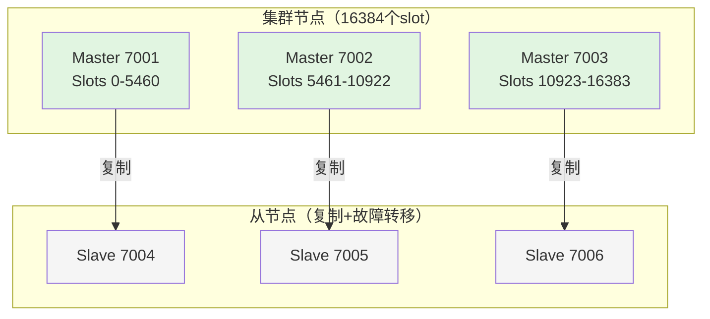
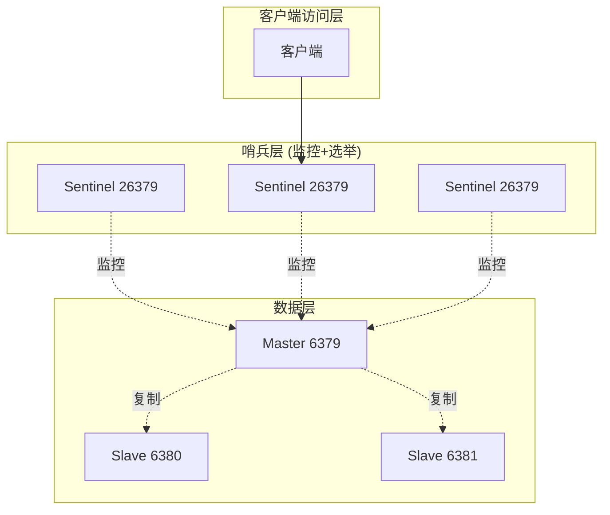
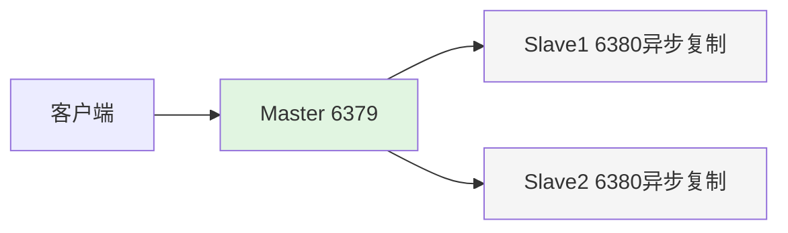
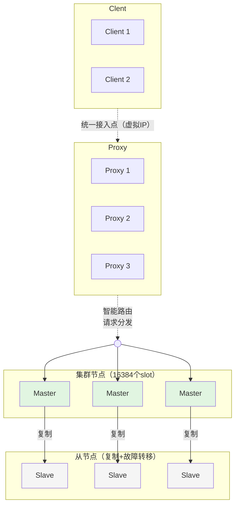

# 前言

许多Web应用都将数据保存到关系型数据库中，应用服务器从中读取数据并在浏览器中显示。但随着数据量的增大、访问的集中，就会出现RDBMS的负担加重、数据库响应恶化、 网站显示延迟等重大影响。redis是高性能的分布式内存缓存服务器,通过缓存数据库查询结果，减少对关系型数据库访问次数，以提高动态Web等应用的速度、 提高可靠性。

# 简介

关系型数据库有与非关系型数据库的区别

```
1.首先了解一下 什么是关系型数据库？
关系型数据库最典型的数据结构是表，由二维表及其之间的联系所组成的一个数据组织。

优点：
1、易于维护：都是使用表结构，格式一致；
2、使用方便：SQL语言通用，可用于复杂查询；
3、复杂操作：支持SQL，可用于一个表以及多个表之间非常复杂的查询。
缺点：
1、读写性能比较差，尤其是海量数据的高效率读写；
2、固定的表结构，灵活度稍欠；
3、高并发读写需求，传统关系型数据库来说，硬盘I/O是一个很大的瓶颈；

二 非关系型数据库
什么非关系型数据库呢？

非关系型数据是一种数据结构化存储方法的集合，可以是文档或者键值对等

优点：
1、格式灵活：存储数据的格式可以是key,value形式、文档形式、图片形式等等，使用灵活，应用场景广泛，而关系型数据库则只支持基础类型。
2、速度快：nosql可以使用硬盘或者随机存储器作为载体，而关系型数据库只能使用硬盘；
3、高扩展性；
4、成本低：nosql数据库部署简单，基本都是开源软件。

缺点：
1、不提供sql支持，学习和使用成本较高；
2、无事务处理；
3、数据结构相对复杂，复杂查询方面稍欠。
```

## 启动redis

管理员身份

redis目录

```
redis-server.exe redis.windows.conf
```

## 注册服务

```
redis-server --service-install redis.windows.conf //安装服务
redis-server --service-start //启动服务
redis-server --service-stop //停止服务
redis-server --service-uninstall //卸载服务
```

```
redis-cli -h host -p port -a password
```

## 数据类型

常用的5种数据结构：

- key-string：一个key对应一个值。
- key-hash：一个key对应一个Map。
- key-list：一个key对应一个List列表。
- key-set：一个key对应一个Set集合。
- key-zset：一个key对应一个有序的Set集合。等价于：Map<Object,Double>

另外3种数据结构：

- HyperLogLog：计算近似值的。
- GEO：地理位置。
- BIT：一般存储的也是一个字符串，存储的是一个byte[]。


- key-string：最常用的，一般用于存储一个值。
- key-hash：存储一个对象数据的。
- key-list：使用list结构实现栈和队列结构。
- key-set：交集，差集和并集的操作。
- key-zset：排行榜，积分存储等操作。

## 常用命令

[redis官网](https://redis.io/docs/latest/commands/set/)

### string

```
SET key value [NX | XX] [GET] [EX seconds | PX milliseconds |
EXAT unix-time-seconds | PXAT unix-time-milliseconds | KEEPTTL]
# EX秒——设置指定的过期时间，以秒为单位（正整数）。
set key1 v1 ex 10  # 10秒后过期
# PX毫秒——设置指定的过期时间，以毫秒为单位（正整数）。
set key k1 v1 px 10 # 10毫米后过期
# EXAT timestamp-秒——设置key过期的指定Unix时间，以秒为单位（正整数）。

# PXATtimestamp-milliseconds——设置密钥过期的指定Unix时间，以毫秒为单位（正整数）。
# NX——仅在key不存在时设置它。
set k1 v1  
get k1 # 输出v1
set k1 v2 nx 
get k1 # 输出v1
set k2 v1 nx
get k2 # 输出v1

# XX——仅在密钥已经存在时设置它。
set k1 v1  
get k1 # 输出v1
set k1 v2 xx 
get k3 # 输出v1
set k2 v1 xx
get k2 # 输出(nil)
# KEEPTTL——保留与密钥关联的生存时间。
# GET--返回存储在key处的旧字符串，如果key不存在则返回nil。如果存储在key处的值不是字符串，则返回错误并中止SET。
set k5 v1 get # 在设置新值的时候，返回旧值
```

### list

```
# 添加三个元素到key的list中，如果key的list不存在就创建
lpush key v1 v2 v3
lrang key 0 -1 # v3 v2 v1 

lpushx key x1 v1 v2 # 仅当key的列表存在时候才添加

llen key # 查看列表的长度

# lrang key start end
lrang key 0 -1 # 查看列表所有元素

# lindex index 查看指定位置的元素
lindex key 1 # 查看索引为1 的元素

# lset key index element 
lset key 0 a # 替换idx=0的元素为a

# 从一个列表移动到另一个列表 
lmove sourse desc right left # 把sourse 右边的元素放到desc的左边

# 插入元素在指定元素之后或者之前 有重复元素的时候插入到第一个元素前后
linset key BEFORE/after "World" "There" # 插入there 在world 之后或者之前

lmpop 后面key的数量 key1 key2  left/right 

lpop key 弹出元素

lpos key el # 返回el在key中index

lrem key count element # 删除元素ele数量为count个

rpop 同 lpop 只不过弹出的方向不一样，lpop是列表右边，rpop是列表左边
rpush 同lpush
rpushx 同lpushx
```

### Hash

```
# 插入map
127.0.0.1:6379> hset map k1 v1 k2 v1
(integer) 2
# 指定map是否存在key 为k2的字段
127.0.0.1:6379> hexists map k2
(integer) 1
# 指定map是否存在key 为k3的字段
127.0.0.1:6379> HEXISTS map k3
(integer) 0


```

### 查看key过期时间

```
ttl key
```

### 发布订阅

```
# 发送消息到mychannel这个频道
127.0.0.1:6379> publish mychannel "Hello, World!"
(integer) 1
# 订阅这个频道
127.0.0.1:6379> SUBSCRIBE mychannel
```

Redis中的发布/订阅（Pub/Sub）机制是一种消息广播模式，而不是消息队列模式。因此，发布的每条消息会被发送到所有当前订阅该频道的订阅者，每个订阅者都会接收到一份消息拷贝。消息不会被存储或持久化，因此，消息只能被消费一次，但可以同时被多个订阅者消费。具体来说：

1. **多个订阅者同时接收消息**：当一个消息被发布到一个频道时，所有订阅该频道的订阅者都会接收到这条消息。每个订阅者都能看到相同的消息。
2. **消息的即时性**：消息是即时发送的。如果没有订阅者，消息就会丢失，不会被存储。
3. **消息不会被持久化**：Redis Pub/Sub 是一个纯内存中的消息传递系统，消息一旦发送就不会被存储。

#### 示例

假设有两个订阅者订阅了 `mychannel`，并且一个发布者向 `mychannel` 发送了一条消息。

1. **订阅者1**：

```
127.0.0.1:6379> SUBSCRIBE mychannel
```

1. **订阅者2**：

```
127.0.0.1:6379> SUBSCRIBE mychannel
```

1. **发布者**：

```
127.0.0.1:6379> PUBLISH mychannel "Hello, Subscribers!"
(integer) 2
```

在这种情况下，`PUBLISH` 命令返回 `2`，表示有两个订阅者接收到消息。每个订阅者都会收到相同的消息：

- **订阅者1接收到的消息**：

```
1) "message"
2) "mychannel"
3) "Hello, Subscribers!"
```

- **订阅者2接收到的消息**：

```
1) "message"
2) "mychannel"
3) "Hello, Subscribers!"
```

#### 总结

在Redis的发布/订阅模式下，每个消息都会被发送到所有订阅该频道的订阅者。消息不会被存储或持久化，因此，每个消息只能被消费一次，但可以同时被多个订阅者消费。如果需要消息持久化和确认机制，可以考虑使用其他消息队列系统，如Redis Streams、Kafka或RabbitMQ等。

### 序列化配置

JDK默认序列化存在序列化结果过大，序列化包含额外信息，存在多个高危的反序列化漏洞。
使用 **json** redis的数据的序列化

```java

@Configuration
public class RedisSerializationConfig {
    
    // ❌ 不推荐：使用JDK序列化
    @Bean
    public RedisTemplate<String, Object> jdkSerializationRedisTemplate() {
        RedisTemplate<String, Object> template = new RedisTemplate<>();
        template.setConnectionFactory(redisConnectionFactory());
        
        // 默认使用JDK序列化
        template.setKeySerializer(new StringRedisSerializer());
        template.setValueSerializer(new JdkSerializationRedisSerializer());  // 问题所在！
        template.setHashKeySerializer(new StringRedisSerializer());
        template.setHashValueSerializer(new JdkSerializationRedisSerializer());
        
        return template;
    }
    
    // ✅ 推荐：使用JSON序列化
    @Bean
    public RedisTemplate<String, Object> jsonSerializationRedisTemplate() {
        RedisTemplate<String, Object> template = new RedisTemplate<>();
        template.setConnectionFactory(redisConnectionFactory());
        
        // 使用JSON序列化
        Jackson2JsonRedisSerializer<Object> serializer = 
            new Jackson2JsonRedisSerializer<>(Object.class);
        
        template.setKeySerializer(new StringRedisSerializer());
        template.setValueSerializer(serializer);
        template.setHashKeySerializer(new StringRedisSerializer());
        template.setHashValueSerializer(serializer);
        
        return template;
    }
    
```


## Redis集群

Redis集群主要有三种部署方式：**主从复制**、**哨兵模式** 和 **Cluster集群模式**。

###  Redis Cluster集群



**特点**：

- **数据分片**：16384个slot分配到多个主节点
- **自动故障转移**：主节点宕机，从节点自动升级为主节点
- **高可用**：每个主节点都有从节点
- **客户端重定向**：客户端连接到错误的节点时，会收到重定向指令

    > 搭建

1. 安装redis

```bash

# Ubuntu/Debian
sudo apt update
sudo apt install redis-server -y

# CentOS/RHEL
sudo yum install epel-release
sudo yum install redis -y

# 或编译安装
wget https://download.redis.io/redis-stable.tar.gz
tar -xzvf redis-stable.tar.gz
cd redis-stable
make && sudo make install

```

2. 准备节点配置

```bash

# 创建集群目录
mkdir -p /opt/redis-cluster/{7001,7002,7003,7004,7005,7006}

# 复制配置文件到每个节点
for port in {7001..7006}; do
  cp redis.conf /opt/redis-cluster/${port}/
done

```

3. 配置每个节点

```bash
# 修改端口号创建其他节点的配置。

# 基础配置
port 7001
bind 0.0.0.0
daemonize yes
pidfile /var/run/redis_7001.pid
logfile "/opt/redis-cluster/7001/redis.log"
dir /opt/redis-cluster/7001/

# 集群配置
cluster-enabled yes
cluster-config-file nodes-7001.conf
cluster-node-timeout 5000
cluster-require-full-coverage no

# 持久化（可选）
appendonly yes
appendfilename "appendonly-7001.aof"

```

4. 启动所有节点

```bash

# 启动所有Redis实例
redis-server /opt/redis-cluster/7001/redis.conf
redis-server /opt/redis-cluster/7002/redis.conf
redis-server /opt/redis-cluster/7003/redis.conf
redis-server /opt/redis-cluster/7004/redis.conf
redis-server /opt/redis-cluster/7005/redis.conf
redis-server /opt/redis-cluster/7006/redis.conf

# 检查进程
ps aux | grep redis

```

5. 创建集群

```bash

# 使用redis-cli创建集群
# --cluster-replicas 1 表示每个主节点有1个从节点
redis-cli --cluster create \
  127.0.0.1:7001 \
  127.0.0.1:7002 \
  127.0.0.1:7003 \
  127.0.0.1:7004 \
  127.0.0.1:7005 \
  127.0.0.1:7006 \
  --cluster-replicas 1

# 输入yes确认配置

```

6. 验证集群

```bash

# 查看集群信息
redis-cli -p 7001 cluster nodes
redis-cli -p 7001 cluster info

# 测试集群
redis-cli -c -p 7001
> set key1 value1
> get key1

# 检查key的slot分布
redis-cli -p 7001 cluster keyslot key1

```

###  哨兵模式（Sentinel）



**特点**：

- **自动故障转移**：主节点宕机，哨兵自动选举新主节点
- **客户端发现**：客户端从哨兵获取当前的主节点地址
- **最少3个哨兵节点**（避免脑裂）
- **写操作**：只到当前主节点

### 主从复制（master-slave）



**特点**：

- **写操作**：只到主节点
- **读操作**：可到主节点或从节点
- **故障转移**：**不支持自动故障转移**，主节点宕机需要手动切换
- **数据一致性**：异步复制，可能有数据延迟

### TCE Proxy Redis Cluster架构



- **客户端透明**：业务像使用单节点Redis一样使用
- **自动分片**：基于CRC16算法，默认16384个slot
- **智能路由**：Proxy自动将请求路由到正确分片
- **弹性伸缩**：支持在线增删分片，数据自动迁移