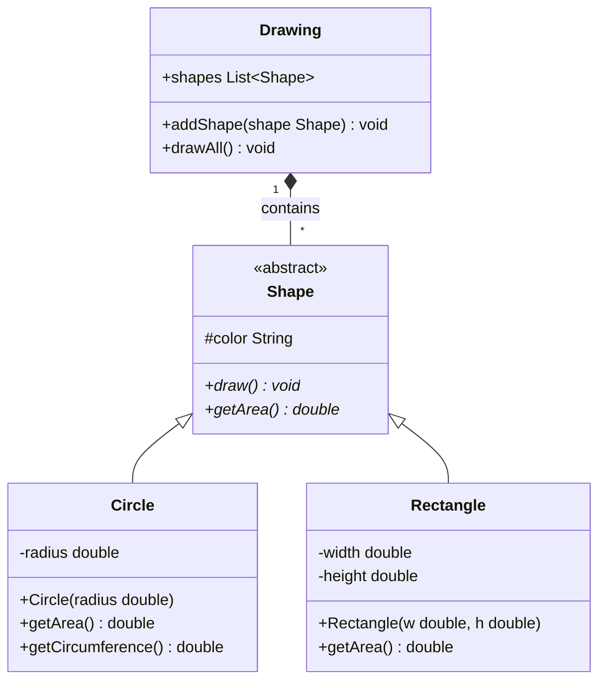

## 类图

```mermaid
classDiagram
    %% 类定义
    class Shape {
        <<abstract>>
        #color String
        +draw() void*
        +getArea() double*
    }
    
    class Circle {
        -radius double
        +Circle(radius double)
        +getArea() double
        +getCircumference() double
    }
    
    class Rectangle {
        -width double
        -height double
        +Rectangle(w double, h double)
        +getArea() double
    }
    
    class Drawing {
        +shapes List~Shape~
        +addShape(shape Shape) void
        +drawAll() void
    }
    
    %% 关系定义
    Shape <|-- Circle
    Shape <|-- Rectangle
    Drawing "1" *-- "*" Shape : contains

```