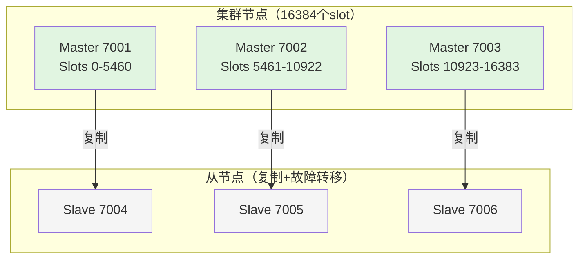
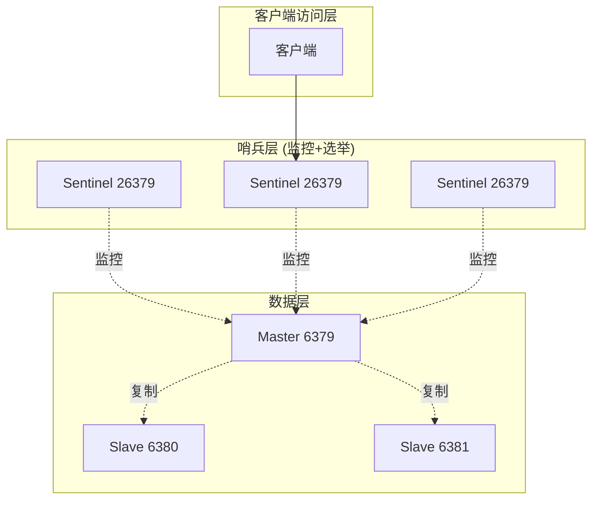
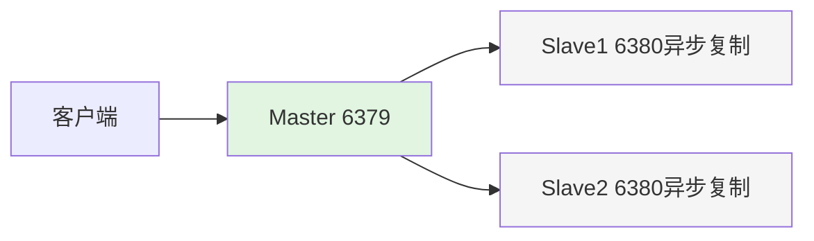
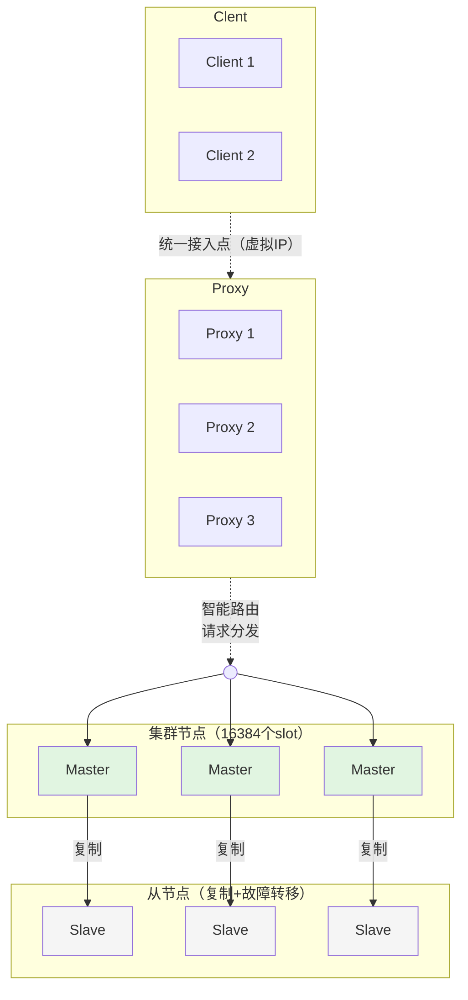

# 前言
许多Web应用都将数据保存到关系型数据库中，应用服务器从中读取数据并在浏览器中显示。但随着数据量的增大、访问的集中，就会出现RDBMS的负担加重、数据库响应恶化、 网站显示延迟等重大影响。redis是高性能的分布式内存缓存服务器,通过缓存数据库查询结果，减少对关系型数据库访问次数，以提高动态Web等应用的速度、 提高可靠性。

# 简介
关系型数据库有与非关系型数据库的区别

```bash
1.首先了解一下 什么是关系型数据库？
关系型数据库最典型的数据结构是表，由二维表及其之间的联系所组成的一个数据组织。

优点：
1、易于维护：都是使用表结构，格式一致；
2、使用方便：SQL语言通用，可用于复杂查询；
3、复杂操作：支持SQL，可用于一个表以及多个表之间非常复杂的查询。
缺点：
1、读写性能比较差，尤其是海量数据的高效率读写；
2、固定的表结构，灵活度稍欠；
3、高并发读写需求，传统关系型数据库来说，硬盘I/O是一个很大的瓶颈；

二 非关系型数据库
什么非关系型数据库呢？

非关系型数据是一种数据结构化存储方法的集合，可以是文档或者键值对等

优点：
1、格式灵活：存储数据的格式可以是key,value形式、文档形式、图片形式等等，使用灵活，应用场景广泛，而关系型数据库则只支持基础类型。
2、速度快：nosql可以使用硬盘或者随机存储器作为载体，而关系型数据库只能使用硬盘；
3、高扩展性；
4、成本低：nosql数据库部署简单，基本都是开源软件。

缺点：
1、不提供sql支持，学习和使用成本较高；
2、无事务处理；
3、数据结构相对复杂，复杂查询方面稍欠。
```

## 启动redis
管理员身份

redis目录

```shell
redis-server.exe redis.windows.conf
```

## 注册服务
```bash
redis-server --service-install redis.windows.conf //安装服务
redis-server --service-start //启动服务
redis-server --service-stop //停止服务
redis-server --service-uninstall //卸载服务
```

```shell
redis-cli -h host -p port -a password
```

## 数据类型
常用的5种数据结构：

+ key-string：一个key对应一个值。
+ key-hash：一个key对应一个Map。
+ key-list：一个key对应一个List列表。
+ key-set：一个key对应一个Set集合。
+ key-zset：一个key对应一个有序的Set集合。等价于：Map<Object,Double>

另外3种数据结构：

+ HyperLogLog：计算近似值的。
+ GEO：地理位置。
+ BIT：一般存储的也是一个字符串，存储的是一个byte[]。


+ key-string：最常用的，一般用于存储一个值。
+ key-hash：存储一个对象数据的。
+ key-list：使用list结构实现栈和队列结构。
+ key-set：交集，差集和并集的操作。
+ key-zset：排行榜，积分存储等操作。

## 常用命令
[redis官网](https://redis.io/docs/latest/commands/set/)

### string
```shell
SET key value [NX | XX] [GET] [EX seconds | PX milliseconds |
EXAT unix-time-seconds | PXAT unix-time-milliseconds | KEEPTTL]
# EX秒——设置指定的过期时间，以秒为单位（正整数）。
set key1 v1 ex 10  # 10秒后过期
# PX毫秒——设置指定的过期时间，以毫秒为单位（正整数）。
set key k1 v1 px 10 # 10毫米后过期
# EXAT timestamp-秒——设置key过期的指定Unix时间，以秒为单位（正整数）。

# PXATtimestamp-milliseconds——设置密钥过期的指定Unix时间，以毫秒为单位（正整数）。
# NX——仅在key不存在时设置它。
set k1 v1  
get k1 # 输出v1
set k1 v2 nx 
get k1 # 输出v1
set k2 v1 nx
get k2 # 输出v1

# XX——仅在密钥已经存在时设置它。
set k1 v1  
get k1 # 输出v1
set k1 v2 xx 
get k3 # 输出v1
set k2 v1 xx
get k2 # 输出(nil)
# KEEPTTL——保留与密钥关联的生存时间。
# GET--返回存储在key处的旧字符串，如果key不存在则返回nil。如果存储在key处的值不是字符串，则返回错误并中止SET。
set k5 v1 get # 在设置新值的时候，返回旧值
```

### list
```shell
# 添加三个元素到key的list中，如果key的list不存在就创建
lpush key v1 v2 v3
lrang key 0 -1 # v3 v2 v1 

lpushx key x1 v1 v2 # 仅当key的列表存在时候才添加

llen key # 查看列表的长度

# lrang key start end
lrang key 0 -1 # 查看列表所有元素

# lindex index 查看指定位置的元素
lindex key 1 # 查看索引为1 的元素

# lset key index element 
lset key 0 a # 替换idx=0的元素为a

# 从一个列表移动到另一个列表 
lmove sourse desc right left # 把sourse 右边的元素放到desc的左边

# 插入元素在指定元素之后或者之前 有重复元素的时候插入到第一个元素前后
linset key BEFORE/after "World" "There" # 插入there 在world 之后或者之前

lmpop 后面key的数量 key1 key2  left/right 

lpop key 弹出元素

lpos key el # 返回el在key中index

lrem key count element # 删除元素ele数量为count个

rpop 同 lpop 只不过弹出的方向不一样，lpop是列表右边，rpop是列表左边
rpush 同lpush
rpushx 同lpushx

```

### Hash
```shell
# 插入map
127.0.0.1:6379> hset map k1 v1 k2 v1
(integer) 2
# 指定map是否存在key 为k2的字段
127.0.0.1:6379> hexists map k2
(integer) 1
# 指定map是否存在key 为k3的字段
127.0.0.1:6379> HEXISTS map k3
(integer) 0


```

### 查看key过期时间
```shell
ttl key
```

### 发布订阅
```shell
# 发送消息到mychannel这个频道
127.0.0.1:6379> publish mychannel "Hello, World!"
(integer) 1
# 订阅这个频道
127.0.0.1:6379> SUBSCRIBE mychannel

```

Redis中的发布/订阅（Pub/Sub）机制是一种消息广播模式，而不是消息队列模式。因此，发布的每条消息会被发送到所有当前订阅该频道的订阅者，每个订阅者都会接收到一份消息拷贝。消息不会被存储或持久化，因此，消息只能被消费一次，但可以同时被多个订阅者消费。具体来说：

1. **多个订阅者同时接收消息**：当一个消息被发布到一个频道时，所有订阅该频道的订阅者都会接收到这条消息。每个订阅者都能看到相同的消息。
2. **消息的即时性**：消息是即时发送的。如果没有订阅者，消息就会丢失，不会被存储。
3. **消息不会被持久化**：Redis Pub/Sub 是一个纯内存中的消息传递系统，消息一旦发送就不会被存储。

#### 示例
假设有两个订阅者订阅了 `mychannel`，并且一个发布者向 `mychannel` 发送了一条消息。

1. **订阅者1**：

```shell
127.0.0.1:6379> SUBSCRIBE mychannel
```

1. **订阅者2**：

```shell
127.0.0.1:6379> SUBSCRIBE mychannel
```

1. **发布者**：

```shell
127.0.0.1:6379> PUBLISH mychannel "Hello, Subscribers!"
(integer) 2
```

在这种情况下，`PUBLISH` 命令返回 `2`，表示有两个订阅者接收到消息。每个订阅者都会收到相同的消息：

+ **订阅者1接收到的消息**：

```shell
1) "message"
2) "mychannel"
3) "Hello, Subscribers!"
```

+ **订阅者2接收到的消息**：

```shell
1) "message"
2) "mychannel"
3) "Hello, Subscribers!"
```

#### 总结
在Redis的发布/订阅模式下，每个消息都会被发送到所有订阅该频道的订阅者。消息不会被存储或持久化，因此，每个消息只能被消费一次，但可以同时被多个订阅者消费。如果需要消息持久化和确认机制，可以考虑使用其他消息队列系统，如Redis Streams、Kafka或RabbitMQ等。

### 序列化配置

JDK默认序列化存在序列化结果过大，序列化包含额外信息，存在多个高危的反序列化漏洞。
使用 **json** redis的数据的序列化

```java

@Configuration
public class RedisSerializationConfig {
    
    // ❌ 不推荐：使用JDK序列化
    @Bean
    public RedisTemplate<String, Object> jdkSerializationRedisTemplate() {
        RedisTemplate<String, Object> template = new RedisTemplate<>();
        template.setConnectionFactory(redisConnectionFactory());
        
        // 默认使用JDK序列化
        template.setKeySerializer(new StringRedisSerializer());
        template.setValueSerializer(new JdkSerializationRedisSerializer());  // 问题所在！
        template.setHashKeySerializer(new StringRedisSerializer());
        template.setHashValueSerializer(new JdkSerializationRedisSerializer());
        
        return template;
    }
    
    // ✅ 推荐：使用JSON序列化
    @Bean
    public RedisTemplate<String, Object> jsonSerializationRedisTemplate() {
        RedisTemplate<String, Object> template = new RedisTemplate<>();
        template.setConnectionFactory(redisConnectionFactory());
        
        // 使用JSON序列化
        Jackson2JsonRedisSerializer<Object> serializer = 
            new Jackson2JsonRedisSerializer<>(Object.class);
        
        template.setKeySerializer(new StringRedisSerializer());
        template.setValueSerializer(serializer);
        template.setHashKeySerializer(new StringRedisSerializer());
        template.setHashValueSerializer(serializer);
        
        return template;
    }
    
```


## Redis集群

Redis集群主要有三种部署方式：**主从复制**、**哨兵模式** 和 **Cluster集群模式**。

###  Redis Cluster集群



**特点**：

- **数据分片**：16384个slot分配到多个主节点
- **自动故障转移**：主节点宕机，从节点自动升级为主节点
- **高可用**：每个主节点都有从节点
- **客户端重定向**：客户端连接到错误的节点时，会收到重定向指令

    > 搭建

1. 安装redis

```bash

# Ubuntu/Debian
sudo apt update
sudo apt install redis-server -y

# CentOS/RHEL
sudo yum install epel-release
sudo yum install redis -y

# 或编译安装
wget https://download.redis.io/redis-stable.tar.gz
tar -xzvf redis-stable.tar.gz
cd redis-stable
make && sudo make install

```

2. 准备节点配置

```bash

# 创建集群目录
mkdir -p /opt/redis-cluster/{7001,7002,7003,7004,7005,7006}

# 复制配置文件到每个节点
for port in {7001..7006}; do
  cp redis.conf /opt/redis-cluster/${port}/
done

```

3. 配置每个节点

```bash
# 修改端口号创建其他节点的配置。

# 基础配置
port 7001
bind 0.0.0.0
daemonize yes
pidfile /var/run/redis_7001.pid
logfile "/opt/redis-cluster/7001/redis.log"
dir /opt/redis-cluster/7001/

# 集群配置
cluster-enabled yes
cluster-config-file nodes-7001.conf
cluster-node-timeout 5000
cluster-require-full-coverage no

# 持久化（可选）
appendonly yes
appendfilename "appendonly-7001.aof"

```

4. 启动所有节点

```bash

# 启动所有Redis实例
redis-server /opt/redis-cluster/7001/redis.conf
redis-server /opt/redis-cluster/7002/redis.conf
redis-server /opt/redis-cluster/7003/redis.conf
redis-server /opt/redis-cluster/7004/redis.conf
redis-server /opt/redis-cluster/7005/redis.conf
redis-server /opt/redis-cluster/7006/redis.conf

# 检查进程
ps aux | grep redis

```

5. 创建集群

```bash

# 使用redis-cli创建集群
# --cluster-replicas 1 表示每个主节点有1个从节点
redis-cli --cluster create \
  127.0.0.1:7001 \
  127.0.0.1:7002 \
  127.0.0.1:7003 \
  127.0.0.1:7004 \
  127.0.0.1:7005 \
  127.0.0.1:7006 \
  --cluster-replicas 1

# 输入yes确认配置

```

6. 验证集群

```bash

# 查看集群信息
redis-cli -p 7001 cluster nodes
redis-cli -p 7001 cluster info

# 测试集群
redis-cli -c -p 7001
> set key1 value1
> get key1

# 检查key的slot分布
redis-cli -p 7001 cluster keyslot key1

```

###  哨兵模式（Sentinel）



**特点**：

- **自动故障转移**：主节点宕机，哨兵自动选举新主节点
- **客户端发现**：客户端从哨兵获取当前的主节点地址
- **最少3个哨兵节点**（避免脑裂）
- **写操作**：只到当前主节点

### 主从复制（master-slave）



**特点**：

- **写操作**：只到主节点
- **读操作**：可到主节点或从节点
- **故障转移**：**不支持自动故障转移**，主节点宕机需要手动切换
- **数据一致性**：异步复制，可能有数据延迟

### TCE Proxy Redis Cluster架构



- **客户端透明**：业务像使用单节点Redis一样使用
- **自动分片**：基于CRC16算法，默认16384个slot
- **智能路由**：Proxy自动将请求路由到正确分片
- **弹性伸缩**：支持在线增删分片，数据自动迁移


## RDB快照
### 手动
#### save


#### bgsave
```bash
# 直接在 redis-cli 中执行
127.0.0.1:6379> BGSAVE
Background saving started

# 查看状态
127.0.0.1:6379> LASTSAVE
(integer) 1746638412

# 查看持久化信息
127.0.0.1:6379> INFO persistence
# Persistence
rdb_bgsave_in_progress:0   # 0=无进行中, 1=正在执行
rdb_last_save_time:1746638412
rdb_last_bgsave_status:ok
```


### 自动
config set save '3600 1'

3600秒内key改变一次就自动保存

### 禁用rdb
config set save ""

## AOF 增量备份
默认是关闭的，<font style="color:rgb(15, 17, 21);">AOF 以</font>**<font style="color:rgb(15, 17, 21);">日志形式</font>**<font style="color:rgb(15, 17, 21);">记录每个</font>**<font style="color:rgb(15, 17, 21);">写操作命令</font>**<font style="color:rgb(15, 17, 21);">，Redis 重启时通过</font>**<font style="color:rgb(15, 17, 21);">重新执行</font>**<font style="color:rgb(15, 17, 21);">这些命令来恢复数据。</font>

### <font style="color:rgb(15, 17, 21);">redis.conf 核心配置</font>
```bash
# 1. 开启 AOF（默认关闭）
appendonly yes

# 2. AOF 文件路径和名称
appendfilename "appendonly.aof"
dir /var/lib/redis/

# 3. 同步策略（重要！）
# appendfsync always    # 每次写命令都同步（最安全，最慢）
appendfsync everysec    # 每秒同步一次（推荐，平衡性能和安全）
# appendfsync no        # 由操作系统决定（最快，最不安全）

# 4. AOF 重写相关
auto-aof-rewrite-percentage 100   # AOF 文件增长 100% 时触发重写
auto-aof-rewrite-min-size 64mb    # AOF 文件至少 64MB 才触发重写

# 5. 加载时处理不完整 AOF
aof-load-truncated yes            # 允许加载不完整的 AOF（恢复时有用）
```

这是一份根据你提供的视频内容整理的结构化 Markdown 笔记，已按模块清晰分类，便于复习和查阅。

---

# Redis 配置管理与核心机制详解
## 一、基础配置与远程访问
### 1.1 文件路径
+ **安装路径**：通过脚本安装，所有文件在脚本指定的目录下。
+ **配置文件**：服务启动时使用的配置文件路径，由 `service` 文件中指定。

### 1.2 远程连接设置
+ **默认监听**：`127.0.0.1:6379` （仅本地连接）。
+ **开启远程**：将配置文件中的 `bind` 从 `127.0.0.1` 改为 `0.0.0.0`，监听所有网卡。

---

## 二、安全性配置
### 2.1 密码认证
+ **默认风险**：默认无密码，知道端口的用户均可连接。
+ **账号模型**：Redis 不支持多用户权限体系，仅有一个默认管理员账号，认证只需密码。
+ **设置密码**：

```plain
requirepass 123456
```

### 2.2 保护模式
+ **作用**：当**未设置密码**且保护模式启用时，Redis 只接受本地连接（`127.0.0.1`），防止空密码被远程攻击。
+ **关闭风险**：若同时关闭保护模式且未设密码，任意远程主机可无需认证连接，极度危险。
    - **案例**：曾有学员公网部署未设密码的 Redis，几分钟内被黑客入侵并获取 Linux 系统 root 权限。

---

## 三、动态配置修改：热加载
### 3.1 Config 命令
+ **原理**：无需重启服务，动态修改部分配置项，避免业务中断。
+ **查看配置**：

```plain
CONFIG GET <parameter>
# 示例
CONFIG GET port
```

+ **修改配置**：

```plain
CONFIG SET <parameter> <value>
# 示例
CONFIG SET port 6666
```

+ **版本兼容性**：
    - Redis 5 以前：不支持动态修改端口。
    - Redis 7 及以上：支持更多参数的动态修改。

### 3.2 限制与最佳实践
+ **局限性**：并非所有参数都可动态修改（例如 `databases` 可能不支持）。
+ **持久化问题**：`CONFIG SET` 仅当前运行期有效，**重启后失效**。
+ **正确做法**：
    1. 使用 `CONFIG SET` 立即生效。
    2. 手动修改配置文件，保证重启后配置一致。

### 3.3 模糊查询
+ **查询所有**：`CONFIG GET *`
+ **按前缀匹配**：`CONFIG GET s*` 获取所有 `s` 开头的配置。

---

## 四、内存限制与 OOM 防范
### 4.1 最大内存设置
+ **参数**：`maxmemory`
+ **默认值**：`0`（不限制）
+ **风险**：无限制会耗尽主机内存，触发操作系统 `OOM Killer` 机制随机杀进程（如 SSH），导致无法远程连接。
+ **建议**：设为物理内存的一半。
+ **单位**：**字节**。例如 1GB 应写为 `1073741824`（即 1024³）。
+ **动态设置**：

```plain
CONFIG SET maxmemory 1073741824
```

---

## 五、慢查询机制
### 5.1 用途与对比
+ **用途**：定位执行时间长的命令，用于性能优化。
+ **Redis vs MySQL**：
    - MySQL 慢查询默认阈值：**秒**（如 10s）。
    - Redis 慢查询默认阈值：**微秒**（10000µs = 10ms）。
+ **统计范围**：仅统计命令执行耗时，不包括网络传输和排队时间。

### 5.2 核心参数
+ **阈值**：`slowlog-log-slower-than` （单位：微秒）。
+ **记录上限**：`slowlog-max-len` （默认 128 条）。

### 5.3 操作命令
+ **查看配置**：`CONFIG GET slowlog-log-slower-than`
+ **修改阈值**：`CONFIG SET slowlog-log-slower-than 1` （测试用，超过 1 微秒即记录）。
+ **查看记录**：`SLOWLOG GET` （默认显示最近 10 条）。
+ **日志内容**：唯一 ID、时间戳、耗时（微秒）、执行命令。

### 5.4 生产禁忌
+ `KEYS *` 在大数据量下会线性扫描所有键，严重阻塞，**生产环境严禁使用**。

---

## 六、持久化机制
### 6.1 持久化必要性
+ **存储本质**：数据存储在内存中，断电或重启即丢失。
+ **目标**：将内存数据写入磁盘实现持久化。

### 6.2 类比 MySQL 备份
| MySQL 备份类型 | 特点 | Redis 对应方案 |
| :--- | :--- | :--- |
| **冷备份** | 停机复制数据 | - |
| **温备份** | 加只读锁导出 | - |
| **热备份** | 不停止服务，利用快照读（可重复读隔离级别） | **RDB** |
| **完全备份** | 导出整个数据库 (`mysqldump`) | **RDB** |
| **增量备份** | 记录变化日志 (`binlog`) | **AOF** |


### 6.3 RDB （快照）
+ **原理**：在某一时间点生成内存数据的完整快照保存到磁盘（类似 MySQL 完全备份）。
+ **流程**：利用“可重复读”思想，在不中断服务的情况下保证数据一致性。

### 6.4 AOF （日志追加）
+ **原理**：记录所有写操作命令，重启时通过重放命令来恢复数据（类似 MySQL `binlog` 增量备份）。

### 6.5 最佳组合
+ **策略**：结合使用 RDB 和 AOF。
+ **优势**：以“完全备份（RDB）+ 增量备份（AOF）”的思想，实现高效且可靠的数据恢复。


根据你提供的视频内容，已整理成结构化的 Markdown 笔记，方便复习与查阅。

---

# Redis 持久化机制：RDB 与 AOF 详解
## 一、持久化概述
### 1.1 两种方式
+ **RDB**：快照机制，将内存数据一次性全量写入磁盘。
+ **AOF**：增量日志机制，记录每次写操作命令。

### 1.2 类比 MySQL 备份
+ RDB → MySQL 完全备份
+ AOF → MySQL binlog 增量备份

### 1.3 默认配置
+ **默认仅开启 RDB**，AOF 默认关闭，需手动启用。

---

## 二、RDB 机制详解
### 2.1 基本概念
+ **存储文件**：`dump.rdb`，生成时全量写入。
+ **覆盖机制**：每次生成新 RDB 会覆盖原文件，默认只保留最新版本。
+ **多版本保留**：可通过脚本拷贝 RDB 文件并添加时间戳，保存多个历史版本。

### 2.2 配置与权限
| 配置项 | 含义 | 默认值 |
| :--- | :--- | :--- |
| `dbfilename` | RDB 文件名 | `dump.rdb` |
| `dir` | 数据文件存储目录 | `/app/redis/data` |


+ **权限注意**：Redis 以 `redis` 用户运行，**数据目录必须对该用户有读写权限**。

### 2.3 手动触发 RDB
有两种命令方式：

| 命令 | 执行方式 | 特点 |
| :--- | :--- | :--- |
| `SAVE` | 主线程同步执行 | **会阻塞所有客户端请求**，生成期间服务不可用 |
| `BGSAVE` | 创建子进程异步执行 | 主进程继续处理请求，**推荐使用** |


#### BGSAVE 执行细节
+ **命名含义**：`BG` = background。
+ **写策略**：子进程先写入**临时文件**（如 `temp-1646.rdb`），写完后**原子性地替换**原 `dump.rdb`，防止写入崩溃导致数据损坏。
+ **验证方式**：执行 `BGSAVE` 后，可用 `ps tree` 观察到新增子进程。

#### 多版本备份自动化脚本
+ **必要性**：保留多个时间点备份以应对误操作。
+ **实现思路**：
    1. 查询 `INFO persistence` 中的 `rdb_bgsave_in_progress` 字段。
        * `1`：正在备份
        * `0`：备份完成
    2. 脚本循环检查状态，变为 `0` 后执行文件拷贝。
    3. 推荐用 SSH 密钥认证 `SCP` 或挂载 NFS 进行远程传输。

### 2.4 自动触发策略
+ **配置指令**：`save <seconds> <changes>`
+ **默认配置**（满足任一即触发 `BGSAVE`）：
    - `save 3600 1` —— 1小时内至少 1 次修改
    - `save 300 100` —— 5分钟内至少 100 次修改
    - `save 60 10000` —— 1分钟内至少 10000 次修改
+ **动态调整**：

```plain
CONFIG SET save "60 3"   # 60秒内3次变化即备份
```

+ **禁用 RDB**：

```plain
CONFIG SET save ""
```

> **兼容性提醒**：Redis 5 之前不支持同一行写多个 `save` 参数，需拆分为多行。
>

### 2.5 缓存场景建议
+ 即使 Redis 仅作 MySQL 缓存，仍建议开启 RDB：
    - 重启后可快速加载缓存，避免大量请求直接穿透至数据库。
    - 降低 MySQL 瞬时压力。

---

## 三、AOF 机制初步
### 3.1 基本概念
+ **定位**：增量持久化，记录所有写操作命令。
+ **默认状态**：**未开启**。
+ **开启方法**：

```plain
appendonly yes
```

+ **版本差异**：Redis 7+ 将 AOF 数据存储在独立目录中，早期版本为单个文件。

### 3.2 开启 AOF 风险警示
+ **直接开启的风险（P0 级事故）**：
    - 直接修改配置重启，**可能导致原有 RDB 数据无法加载**。
    - 结果：出现上千万条记录“消失”的严重后果。
+ **提示**：正确的安全启用流程将另行详细讲解。

---

## 四、核心要点回顾
1. **线上禁用 **`SAVE`，统一使用 `BGSAVE`，避免阻塞。
2. `BGSAVE`** + 监控脚本**，可实现自动多版本备份。
3. **AOF 不能直接盲目开启**，需按正确流程从 RDB 切换，否则易导致全量数据丢失。
4. **即便纯粹当缓存用**，保留 RDB 也能防止重启后缓存击穿拖垮后端数据库。根据你提供的视频内容，已整理成结构化的 Markdown 笔记，方便复习与查阅。

---

# Redis AOF 持久化机制与核心数据类型
## 一、AOF 开启导致数据丢失的真相
### 1.1 问题现象
开启 AOF 功能后重启 Redis，所有数据丢失。

### 1.2 根本原因
+ **加载优先级**：开启 AOF 后，Redis 启动时**优先加载 AOF 文件**，而非 RDB 文件。
+ **空文件覆盖**：新开启的 AOF 文件为空，启动时加载空 AOF，导致内存数据被清空。
+ **数据未损坏**：原始数据仍保存在 RDB 文件中，但被优先级更高的空 AOF 文件“屏蔽”。

### 1.3 AOF 工作机制
+ **本质**：增量备份机制，记录所有写操作日志（类似 MySQL binlog）。
+ **实时性**：执行写命令后立即追加到 AOF 文件，文件大小随之变化。
+ **版本差异**：
    - 老版本：单独 `.aof` 文件。
    - Redis 7+：存放在独立目录中的多个文件集合。

---

## 二、正确开启 AOF 的方法
### 2.1 错误方式（禁止）
直接修改配置文件 `appendonly no` → `yes` 后重启服务，导致加载空 AOF 丢失全部数据。

### 2.2 推荐流程
**第一步：动态开启**

```plain
CONFIG SET appendonly yes
```

+ 此命令**立即生效**，无需重启。
+ 触发首次 `BGREWRITEAOF`，生成包含当前全量数据的基础 AOF 文件。

**第二步：持久化配置**  
手动修改配置文件 `appendonly yes`，确保重启后配置仍生效。

### 2.3 开启后的备份模式
+ **首次**：触发全量备份，生成基础数据文件（类似 RDB 快照）。
+ **后续**：以追加方式记录增量变更，实现“**全量（基础文件） + 增量（追加日志）**”模式。

---

## 三、AOF 同步策略
### 3.1 三种策略对比
| 策略 | 同步频率 | 数据安全性 | 性能影响 | 丢失风险 |
| :--- | :--- | :--- | :--- | :--- |
| `always` | 每次写操作立即同步 | 最高 | **性能最差**，频繁磁盘 IO | 几乎不丢数据 |
| `everysec`（默认） | 每秒同步一次 | 中等 | 较好，平衡选择 | 最多丢失 1 秒数据 |
| `no` | 由操作系统决定（约 30s） | 最低 | **性能最好** | 可能丢失最多 30 秒数据 |


### 3.2 选择建议
+ 数据不可丢失 → `always`
+ 可接受少量丢失 → `everysec`（默认推荐）
+ 性能优先 → `no`

---

## 四、AOF vs RDB 优劣对比
### 4.1 AOF 优势
1. **数据安全性更高**
    - RDB 默认 60 秒或满足条件才保存一次，丢失窗口大。
    - AOF 可实现近实时保存，丢失窗口极小。
2. **支持误删恢复**
    - 可编辑 AOF 文件，删除 `FLUSHALL` 等误操作指令后重启恢复。
    - 类似 MySQL binlog 回滚机制。
3. **写入效率更高**
    - AOF 为追加式写入，仅记录变更。
    - RDB 需全量写入整个内存数据，IO 压力大。

### 4.2 AOF 缺点
+ **文件膨胀**：持续追加导致历史操作堆积，同一 Key 多次修改产生大量冗余记录。
+ **体积巨大**：AOF 文件体积远超 RDB，占用更多磁盘空间。

---

## 五、AOF 重写机制（Rewrite）
### 5.1 重写目的
+ 清理冗余操作，仅保留每个 Key 的**最终状态**。
+ 生成新的紧凑 AOF 文件，替代原文件以缩小体积。

### 5.2 重写实现流程
1. 父进程创建子进程进行重写。
2. 主进程继续处理请求，新写入同时记录到 **AOF buffer** 和 **Rewrite buffer**。
3. 子进程完成重写后，主进程将 Rewrite buffer 内容追加到新文件末尾，保证数据一致性。

### 5.3 自动触发条件
```plain
auto-aof-rewrite-percentage 100   # AOF 大小超过上次重写后大小的 100%
auto-aof-rewrite-min-size 64mb    # AOF 文件至少达到 64MB
```

### 5.4 重写期间同步策略
```plain
aof-rewrite-incremental-fsync yes  # 每生成 32MB 数据同步一次，避免长时间阻塞
```

---

## 六、AOF 文件损坏处理
### 6.1 配置项
```plain
aof-load-truncated yes/no
```

+ `yes`（默认）：允许加载不完整的 AOF 文件，忽略尾部损坏命令。
+ `no`：拒绝加载损坏文件，需人工用 `redis-check-aof --fix` 修复。

---

## 七、Redis 核心数据类型
### 7.1 五种类型
1. 字符串（String）
2. 哈希表（Hash）
3. 列表（List）
4. 集合（Set）
5. 有序集合（Sorted Set）

---

## 八、字符串类型（String）详解
### 8.1 基本操作
| 命令 | 说明 | 示例 |
| :--- | :--- | :--- |
| `SET` | 设置键值 | `SET key value` |
| `GET` | 获取值 | `GET key` |
| `DEL` | 删除键 | `DEL key` |
| `TYPE` | 查看类型 | `TYPE key` |


### 8.2 数值操作
| 命令 | 说明 | 应用场景 |
| :--- | :--- | :--- |
| `INCR` | 自增 1 | 计数器（如点赞数） |
| `DECR` | 自减 1 | – |


### 8.3 批量操作
```plain
MSET key1 val1 key2 val2   # 批量设置
MGET key1 key2              # 批量获取
```

### 8.4 带过期时间设置
```plain
SETEX key seconds value    # 设置字符串并指定 TTL
```

应用场景：优惠券限时使用。

---

## 九、列表类型（List）详解
### 9.1 基本特性
+ 有序、可重复的元素序列。
+ 支持双向插入和弹出。
+ 下标从 `0` 开始（正向），`-1` 表示最后一个元素（反向）。

### 9.2 插入与弹出操作
| 命令 | 方向 | 说明 |
| :--- | :--- | :--- |
| `LPUSH` | 左端 | 从左侧推入元素 |
| `RPUSH` | 右端 | 从右侧推入元素 |
| `LPOP` | 左端 | 从左侧弹出元素 |
| `RPOP` | 右端 | 从右侧弹出元素 |


### 9.3 实现栈与队列
| 数据结构 | 操作组合 | 特性 |
| :--- | :--- | :--- |
| 栈 | `LPUSH` + `LPOP` | 先进后出（FILO） |
| 队列 | `LPUSH` + `RPOP` | 先进先出（FIFO） |


### 9.4 其他常用命令
| 命令 | 说明 |
| :--- | :--- |
| `LLEN key` | 获取列表长度 |
| `LRANGE key 0 -1` | 获取全部元素 |
| `LINDEX key index` | 获取指定索引元素 |
| `LSET key index value` | 设置指定索引值 |
| `DEL key` | 删除整个列表 |


根据你提供的视频内容，已整理成结构化的 Markdown 笔记，便于复习与查阅。

---

# Redis 数据类型（Set, ZSet, Hash）与消息队列
## 一、集合（Set）
### 1.1 与列表（List）的区别
| 对比维度 | 列表 (List) | 集合 (Set) |
| :--- | :--- | :--- |
| 元素顺序 | **有序**，有唯一编号（下标） | **无序**，无索引 |
| 元素唯一性 | 可重复 | **值唯一**，不可重复 |


### 1.2 核心特性
+ 元素值不可重复
+ 无索引、无顺序
+ 专为集合间运算设计

### 1.3 核心应用：集合运算
| 操作 | 命令 | 逻辑说明 | 示例 |
| :--- | :--- | :--- | :--- |
| 交集 | `SINTER` | 两集合共同元素 | `SINTER myfriend hisfriend` |
| 并集 | `SUNION` | 全部元素去重合并 | `SUNION myfriend hisfriend` |
| 差集 | `SDIFF` | 我有而对方没有的 | `SDIFF A B` ≠ `SDIFF B A` |


**差集方向性示例**：

+ A = {Li, Zhao, Wang}，B = {Wang, Ma, Sun}
+ `SDIFF A B` → {Li, Zhao}
+ `SDIFF B A` → {Ma, Sun}

### 1.4 实际应用场景
| 场景 | 运算类型 | 说明 |
| :--- | :--- | :--- |
| 微信朋友圈评论可见 | **交集** | 仅发帖人与评论人共同好友可见 |
| QQ空间评论可见 | **并集** | 所有访客均可见 |


### 1.5 基本操作
```plain
SADD myfriend Li Zhao    # 创建集合并添加元素
TYPE myfriend            # 返回 set
```

---

## 二、有序集合（Sorted Set / ZSet）
### 2.1 与普通集合的本质区别
在集合“值唯一、无序”基础上，增加**评分（score）**字段，实现自动排序。

### 2.2 数据结构定义
每个元素由两部分组成：

+ **score**：数值型评分，可重复
+ **member**：字符串型成员值，必须唯一

### 2.3 核心应用场景
所有需要按权重/热度/评分**动态排序**的场景：

+ 搜索引擎结果排名
+ 电商商品销量排行
+ 抖音/豆瓣电影热榜
+ 音乐排行榜

### 2.4 创建与排序操作
**创建数据**：

```plain
ZADD movie 100 "Nezha2" 90 "NanjingPhoto" 5 "ShanghaiBaoLei" 100 "Titanic"
```

**正序查询**（低分 → 高分）：

```plain
ZRANGE movie 0 -1               # 不显示分数
ZRANGE movie 0 -1 WITHSCORES    # 带分数显示
```

**倒序查询**（高分 → 低分）：

```plain
ZREVRANGE movie 0 -1 WITHSCORES
```

### 2.5 与 MySQL 对比
Redis 有序集合的排序效率**远高于 MySQL 的 ORDER BY**，尤其适用于高并发实时排序需求。

---

## 三、哈希（Hash）
### 3.1 数据结构
由多个 `field-value` 对组成的嵌套结构，即“键中键”。整体哈希值是 Redis 的一个 Key。

### 3.2 核心特性
+ field 相当于子键，value 为其对应值
+ 适合存储结构化对象

### 3.3 典型应用场景
存储对象的多个属性，如用户信息：

+ Key：`user:9527`
+ Fields：`name`、`age`、`gender`

### 3.4 操作命令
```plain
# 创建/更新
HSET user:9527 name "Zhou Xingchi" age 30

# 查询全部
HGETALL user:9527

# 查询单个字段
HGET user:9527 name

# 类型验证
TYPE user:9527           # 返回 hash
```

---

## 四、Redis 消息队列
### 4.1 消息队列基本概念
+ **消息**：业务数据（如下单请求）
+ **队列**：先进先出（FIFO）的数据结构
+ **核心价值**：**异步解耦**，解决服务间强依赖问题

**典型应用**：订单服务将下单消息写入队列后立即返回成功，短信通知服务异步消费，即使短信服务宕机也不影响主流程。

### 4.2 两种实现模式对比
| 维度 | 生产者-消费者模式 | 发布者-订阅者模式 |
| :--- | :--- | :--- |
| **消费特性** | 消息被一个消费者**独占消费**后删除 | 消息被**所有订阅者**同时接收 |
| **类比** | 卖包子（一人买走） | 广播电台（多人收听） |
| **实现基础** | **List（列表）** 数据类型 | 专用命令 `PUBLISH`/`SUBSCRIBE` |
| **消息持久化** | 支持（List 数据持久化） | **不支持**，未订阅期间的消息丢失 |
| **回溯能力** | 有 | 无 |
| **负载均衡** | 多消费者 RPOP 天然实现 | 无，所有订阅者均收到相同消息 |


### 4.3 生产者-消费者模式操作
```plain
# 生产（左进）
LPUSH order_queue "order1"

# 消费（右出，保证 FIFO）
RPOP order_queue
```

多消费者竞争 `RPOP` 时，天然实现负载均衡。

### 4.4 发布者-订阅者模式操作
```plain
# 订阅（必须先执行）
SUBSCRIBE channel_name

# 模糊匹配订阅
PSUBSCRIBE news.*

# 发布
PUBLISH channel_name "message content"
```

**关键规则**：**必须先订阅后发布**，发布时未在线的订阅者无法收到历史消息。

---

## 五、数据类型选型指南
| 业务场景 | 推荐数据类型 |
| :--- | :--- |
| 排行榜 / 动态排序 | 有序集合（ZSet） |
| 社交关系 / 标签匹配 | 集合（Set） |
| 对象属性存储 | 哈希（Hash） |
| 异步任务分发 / 消息队列 | 列表（List）或发布订阅（Pub/Sub） |


---

根据视频内容，已将 Redis 主从复制的知识点整理并详细拓展为结构化的 Markdown 笔记。

---

# Redis 主从复制（Master-Replica Replication）详解
## 一、主从复制背景与目的
### 1.1 单机 Redis 的局限性
+ **性能瓶颈**：单机 QPS 和处理能力有物理上限。
+ **高可用问题**：机器故障直接导致业务中断，无容灾能力。

### 1.2 与 MySQL 主从复制的类比
Redis 主从复制与 MySQL 主从复制**机制高度相似**，主要解决两大问题：

1. **读写分离，提升读性能**：一个主节点带多个从节点，读操作分摊到从节点。
2. **数据冗余，保障高可用**：当主节点故障时，可切换到从节点继续服务。

### 1.3 读写能力分析
+ **读性能提升**：通过增加从节点数量实现水平扩展。
+ **写性能瓶颈**：所有写操作必须由主节点处理，**写性能无法扩展**，甚至因数据同步开销略低于单机。此点与 MySQL 主从复制一致。

---

## 二、核心架构与基本原则
### 2.1 基本架构
+ **主节点（Master）**：负责处理所有写操作。
+ **从节点（Replica）**：负责处理读操作，数据由主节点同步而来。
+ **自动同步**：主库数据更新后，自动推送至所有从库，无需应用层介入。

### 2.2 持久化强制原则
+ **主节点必须开启持久化（RDB/AOF）**
    - **致命风险**：若主节点不开启持久化，一旦重启，其内存清空。由于同步是自动的，它会将**空数据集**同步给所有从节点，导致整个集群数据被清空。
+ **从节点可选持久化**
    - 从节点持久化非强制，但建议开启以加速本地重启恢复。

---

## 三、配置实践详解
### 3.1 环境准备
假设有三台节点：

+ 主节点：`10.0.0.100`，已存有千万级数据。
+ 从节点1：`10.0.0.101`，初始为空。
+ 从节点2：`10.0.0.102`，初始为空。

### 3.2 核心配置命令
| 配置项 | 作用 | 配置位置 | 示例 |
| :--- | :--- | :--- | :--- |
| `replicaof <ip> <port>` | 指定主节点地址与端口 | 从节点 | `replicaof 10.0.0.100 6379` |
| `masterauth <password>` | 提供主节点的认证密码 | 从节点 | `masterauth 123456` |
| `requirepass <password>` | 设置本节点的连接密码 | **所有节点** | `requirepass 123456` |


### 3.3 动态配置与验证步骤
1. **主库前置**：确保主库已设置 `requirepass`。
2. **从库配置**：

```plain
# 指定主库
replicaof 10.0.0.100 6379

# 补填认证密码（若上一步报错认证失败）
masterauth 123456
```

3. **成功验证**：
    - 日志显示 `SYNC succeeded`。
    - 从节点执行 `DBSIZE`，数量会与主库一致。
    - 主库新增 Key，从库数据实时变化。

### 3.4 配置持久化
动态执行的 `replicaof` 和 `masterauth` 在 Redis 重启后会失效。必须将配置**写入 **`redis.conf`** 文件**末尾：

```plain
replicaof 10.0.0.100 6379
masterauth 123456
```

### 3.5 全节点密码统一规范
**强烈要求：所有节点的 **`requirepass`** 和 **`masterauth`** 必须设为相同值。**

原因是：

+ **简化客户端连接**：集群作为整体提供服务，客户端用同一密码即可连接任意节点。
+ **保障故障转移**：未来进行主从切换时，新主库的密码不变，连接和同步能无缝衔接，不会因密码问题中断。

---

## 四、状态监控与健康探测
### 4.1 核心监控命令：`INFO replication`
**查看节点角色与状态**：

+ **主节点视角**：

```latex
role:master
connected_slaves:2
slave0:ip=10.0.0.101,port=6379,state=online,offset=...
```

+ **从节点视角**：

```latex
role:slave
master_host:10.0.0.100
master_port:6379
master_link_status:up   # 连接状态
```

### 4.2 故障探测机制与 `master_link_status`
+ **探测指标**：`master_link_down_since_seconds`。
+ **判定逻辑**：
    - 正常连接时，该值在 `0-10` 间循环跳动。
    - 一旦**连续10秒**无法连接主库，该值开始递增。
    - 持续超过 **60 秒**，`master_link_status` 变为 `down`。主节点的 `INFO replication` 中，该从节点会消失。

---

## 五、数据同步原理深度解析
### 5.1 增量复制（Partial Resync）
Redis 主库会在内存中维护一个固定大小的**复制缓冲区**，并为每条写命令生成一个全局递增的偏移量。

1. **正常同步**：主库将写命令同时写入缓冲区和从库。
2. **中断恢复**：从库重连后，向主库发送自己的 `offset`。
3. **核验与续传**：
    - 主库检查该 `offset` 是否还在缓冲区内。
    - **如果在**，则将该 `offset` **之后的所有命令**发送给从库，实现无缝续传。
4. **日志关键词**：`Partial resynchronization`。

### 5.2 全量复制（Full Resync）
当续传条件不满足时，触发全量复制。

**触发场景**：

1. **从库离线过久**：其 `offset` 所对应的数据已被主库缓冲区新数据覆盖（缓冲区满）。
2. **主库重启**：主库重启后，内部运行 ID（`run_id` / `repl_id`）改变。从库首次连接时携带旧 ID，主库校验不匹配，便触发全量同步。

**执行流程**：

1. 主库执行 `BGSAVE` 生成当前数据的 RDB 快照。
2. 主库将 RDB 文件发送给从库。
3. 从库清空自身数据，加载 RDB 文件。
4. 主库再将生成 RDB 期间累积的写命令发送给从库，完成最终同步。
5. **日志关键词**：`Full resync`，且从库日志会显示 `Loading RDB`。

---

## 六、集群管理与命令演进
### 6.1 解除主从关系
在从节点执行此命令，它将升级为独立的、可读写的 Master 节点，**原有数据会保留**。

```plain
replicaof no one
```

### 6.2 命令演进：`SLAVEOF` → `REPLICAOF`
+ **历史背景**：旧版依赖 `SLAVEOF` 命令。
+ **变更原因**：为避免“slave”一词在技术术语中的敏感性，Redis 社区决定弃用。
+ **兼容性**：新版 `REPLICAOF` 是标准用法，功能完全相同，但部分旧版可能仍支持 `SLAVEOF`。

---

## 七、高级架构：级联复制
### 7.1 拓扑结构
为减轻主库的同步压力（如从库数量庞大时），采用多层级复制链：  
`Master -> Replica1 -> Replica2`

+ **中间节点（Replica1）**：既是主库的从库，又是下游从库的主库。
+ **好处**：同步压力传递到级联节点，主库只需与少数几个一级从库直接交互。

### 7.2 实现方法
1. **中间节点（**`.101`**）**：按常规方式配置为 `.100` 的从库。
2. **末端节点（**`.102`**）**：配置指向中间节点 `.101` 而非主库 `.100`。

```plain
replicaof 10.0.0.101 6379
masterauth 123456
```

### 7.3 验证与注意
+ 主库新增键，能正确同步到末端节点。
+ 首次级联同步时日志会显示 `Full resync`，后续转为增量同步。
+ **缺陷**：若中间节点故障，其下游所有从库都会与主库失联，增加了故障点。根据你提供的视频内容，已详细整理并拓展为结构化的 Markdown 笔记，涵盖了全量/增量复制机制、性能优化、常见错误及 Sentinel 方案的引入。

---

# Redis 主从复制：同步机制、优化与 Sentinel 引入
## 一、全量复制（Full Resync）深度解析
### 1.1 标准执行流程
当首次建立主从关系或因故障无法增量同步时，触发此流程：

1. **发起请求**：从节点向主节点发送 `PSYNC ? -1` 命令，请求同步。
2. **元数据握手**：主节点返回自身的 `replid` 和当前复制偏移量 `offset`。
3. **保存元数据**：从节点将接收到的 `replid` 和 `offset` 在本地持久化保存。
4. **生成 RDB 快照**：主节点执行类似 `BGSAVE` 操作，将当前内存数据生成 RDB 文件。
    - 在此过程中，新的写命令会被暂存在 **复制缓冲区 **`repl-backlog` 中。
5. **传输与加载**：
    - 主节点将 RDB 文件通过网络发送给从节点。
    - 发送完成后，紧接着将 `repl-backlog` 中从 `offset` 之后累积的增量数据也发送过去。
6. **从节点恢复**：从节点先清空自身旧数据，然后加载 RDB 文件，最后应用增量数据，完成同步。

### 1.2 触发全量复制的三大场景
| 场景 | 原因分析 |
| :--- | :--- |
| **从节点偏移量丢失** | 主节点的 `repl-backlog` 是固定大小的环形队列，被新数据写满后会**覆盖旧数据**。若从节点长时间离线，其所需 `offset` 的数据已被覆盖，只能全量同步。 |
| **主节点重启** | 主节点重启后，会生成新的 `replid`。从节点重连时携带的是旧 `replid`，主节点校验不匹配，拒绝增量同步，强制全量。 |
| **从节点重启且缓冲区已满** | 从节点重启后重连，若中断期间主节点写入量过大导致 `repl-backlog` 被覆盖，同样触发全量同步。 |


---

## 二、增量复制（Partial Resync）机制
### 2.1 触发条件与流程
适用于网络临时抖动导致的短暂断开后重连。

1. **前提条件**：中断期间，主节点的 `repl-backlog` 未被写满覆盖。
2. **重连握手**：从节点向主节点发送自身保存的 `replid` 和已同步到的 `offset`。
3. **核验续传**：主节点检查该 `offset`：
    - **若仍存在于 **`repl-backlog`** 中**：将此 `offset` 之后的所有命令发送给从节点，完成同步。
    - **若已被覆盖**：退化为**全量复制**。
4. **日志标识**：日志中会出现 `Partial resynchronization`。

---

## 三、核心缓冲区：`repl-backlog` 配置
### 3.1 结构与风险
+ **结构**：环形队列，**默认大小为 1MB** (`repl-backlog-size 1048576`)。
+ **风险**：默认值过小。在写入密集场景下，1MB 瞬间就会被写满，导致短暂的网络抖动也会使从节点被迫进行耗时的全量复制。

### 3.2 容量估算公式
```plain
repl-backlog-size = 允许的最大中断时间（秒） × 主节点每秒写入数据量（字节/秒）
```

**示例**：若允许中断 10 分钟 (600s)，每秒写入 10MB，则应设为：  
`600 × 10 × 1024 × 1024 = 约 6 GB`

### 3.3 合理性与约束
+ **现实权衡**：需结合实际物理内存设置。例如，若 Redis 总内存仅 10GB，分配 6GB 给缓冲区不现实。
+ **超时释放**：可通过配置，当从节点断连超过指定时长（如 3600 秒），主节点主动释放该部分缓冲区内存。

---

## 四、性能优化配置项
| 配置项 | 作用 | 取值与说明 |
| :--- | :--- | :--- |
| `repl-diskless-sync` | **无盘复制** | `yes`：不写 RDB 文件，直接从内存序列化后网络发送，降低磁盘 IO 压力，但可靠性稍降。   `no`：(默认) 先写磁盘 RDB 文件再传输。 |
| `repl-diskless-sync-delay` | 无盘复制等待期 | 单位秒。等待更多从节点接入后再开始传输，避免首节点完成后，新节点到来引发多次全量。 |
| `repl-ping-replica-period` | 心跳监测 | 默认 10 秒。主节点向从节点发送 `PING` 的周期，用于判断连接健康状态。 |
| `tcp-nodelay` | 网络优化 | `yes`：禁用 Nagle 算法，小包立即发送，减少延迟，适用于 Redis 高频小命令场景。   `no`：启用 Nagle 算法，合并小包以节约带宽，但会增加延迟。 |
| `min-replicas-to-write`   `min-replicas-max-lag` | **数据安全与一致性** | 类比 MySQL 半同步复制。确保写命令至少被指定数量的从节点成功同步后，主节点才返回写入成功。可有效防止主节点故障时数据丢失。 |


---

## 五、常见错误排查指南
| 错误现象 | 排查方向 |
| :--- | :--- |
| 全量复制后数据不一致或失败 | 主从节点 `maxmemory`** 设置不一致**，导致从节点无法容纳主库的全部数据。 |
| 特定命令执行失败 | 危险命令（如 `FLUSHALL`）在主从节点**禁用配置不一致**。 |
| 连接认证失败 | `masterauth`** 密码配置错误**或主库 `requirepass` 已修改。 |
| 协议或功能异常 | **主从 Redis 版本不兼容**，建议统一版本。 |
| 远程复制被拒 | 新版本保护模式 `protected-mode yes` 开启，需正确配置 `bind` 或 `requirepass` 才能建立远程连接。 |


---

## 六、主从复制的局限与 Sentinel 的引入
### 6.1 主从架构的致命缺陷
+ **写单点故障**：所有**写操作必须由主节点处理**。主节点宕机，则整个集群写入服务完全中断。
+ **读能力可扩展**：通过增加从节点实现。
+ **故障恢复靠人工**：传统切换步骤繁琐且易出错：
    1. 手动从剩余从库中选一个执行 `REPLICAOF NO ONE` 提升为主库。
    2. 修改其他从库的 `REPLICAOF` 指向新主库。
    3. 修改所有应用客户端的连接地址。
+ **结论**：**主从复制未解决写扩展与自动高可用问题。**

### 6.2 Redis Sentinel 解决方案
正是为了解决上述痛点，Redis 官方推出了 **Sentinel（哨兵）** 高可用方案。

+ **设计目标**：提供 **自动化的故障检测、转移和通知**。
+ **核心组件**：一个或多个独立的 Sentinel 进程组成的**哨兵集群**。
+ **工作机制**：
    1. **监控**：哨兵集群持续监控所有主从节点的健康状态。
    2. **自动故障转移**：当主库失联被确认，哨兵集群通过多数派机制，自动从一个健康从库中选举一个新主库（基于数据新鲜度、副本优先级等规则）。
    3. **自动配置更新**：哨兵通过发布/订阅模式，通知客户端新的主库地址，并将其他从库指向新主库。
    4. **自身高可用**：采用多哨兵集群，解决单哨兵自身的可靠性问题。

通过 Sentinel，Redis 真正实现了无需人工干预的全自动故障转移，弥补了主从复制架构的根本性缺陷。


根据你提供的视频内容，已详细整理并拓展为结构化的 Markdown 笔记。

---

# Redis Sentinel（哨兵）高可用机制详解
## 一、哨兵概述与核心作用
### 1.1 引入背景
+ **版本**：自 Redis 2.6+ 引入，是独立于主从复制之外的核心功能。
+ **定位**：**专用于解决主从架构中主节点的单点故障问题**。主节点宕机时，自动完成故障转移。

### 1.2 哨兵集群结构
+ **部署形态**：以**集群**形式部署，通常由 **3 个或更多奇数个**节点构成。
+ **复用能力**：一套哨兵集群可同时监控和管理多组相互独立的 Redis 主从集群。

### 1.3 故障转移全流程概述
1. **发现故障**：哨兵集群检测到主节点异常。
2. **选定新主**：自动从一个健康的从节点中选举出一个新主库。
3. **配置重写**：将其他从节点的复制源指向新主库。
4. **旧主降级**：原主节点恢复后，哨兵自动将其降级为新主库的从节点。  
整个过程无需人工干预，全自动完成。

### 1.4 生产部署建议
+ **黄金搭档**：主从复制 + 哨兵 = **完整的高可用方案**。
+ **资源优化**：小规模环境下，哨兵进程可与 Redis 实例部署在同一物理机上，节省资源。
+ **独立部署**：企业多组主从集群场景，建议哨兵集群独立部署，避免相互影响。

---

## 二、故障检测机制：主观下线与客观下线
这是哨兵防止误判、确保决策准确性的核心机制。

| 概念 | 定义 | 触发条件与作用 |
| :--- | :--- | :--- |
| **主观下线 (SDown)** | 单个哨兵节点认为主节点不可达。 | 基于自身心跳检测（如每秒 `PING` 无响应）。**单独存在不触发故障转移**，只是“一家之言”。 |
| **客观下线 (ODown)** | 多数哨兵一致认为主节点不可达。 | 当**超过 **`quorum`** 数量**的哨兵都将该主库标记为 SDown 时，状态升级为 ODown。**这是触发故障转移的真正依据。** |


+ **法定票数 (**`quorum`**)**：需手动配置，通常设为 `节点数/2 + 1`。
    - 3 节点集群 → `quorum = 2`
    - 5 节点集群 → `quorum = 3`

---

## 三、故障转移完整执行流程
当主节点被判为 ODown 后，自动执行以下步骤：

1. **哨兵 Leader 选举**
    - 所有判定 ODown 的哨兵节点通过内部投票，选出一个**Leader 哨兵**，负责本次转移的具体执行，避免多头指挥。
2. **新主节点选举与提升**
    - Leader 哨兵依据**从节点优先级 (**`replica-priority`**)、数据新鲜度（与旧主同步的完整性）等规则**，选出最佳从节点。
    - 向该从节点执行 `REPLICAOF NO ONE`，将其提升为新主库。
3. **从节点配置重写**
    - Leader 哨兵修改其余所有从节点的配置，使它们开始从新主库同步数据。
4. **动态配置更新**
    - 故障转移成功后，哨兵会自动更新其配置文件，记录最新的拓扑信息。
5. **旧主降级处理**
    - 若原主库恢复运行，哨兵会自动检测到它，并将其降级为新主库的从节点。

---

## 四、客户端连接方式根本性变更
集成哨兵后，客户端**不能**再直连 Redis IP，否则无法感知故障切换。

### 4.1 交互模式变化
| 模式 | 客户端连接对象 | 代码行为 |
| :--- | :--- | :--- |
| **单机/主从**（旧） | 直连 Redis 主节点（写）或从节点（读） | 地址固定，主库宕机即写失败。 |
| **哨兵模式**（新） | **连接哨兵节点**（默认端口 26379） | 先向哨兵查询当前主库地址，再连接。主库变化时可动态重连。 |


### 4.2 客户端访问与发现流程
1. 客户端向任一哨兵查询：“谁是当前主库？”（`SENTINEL get-master-addr-by-name <master-name>`）
2. 哨兵返回当前主库的 IP 和端口。
3. 客户端连接该地址，执行 `ROLE` 命令验证其确实是主库。
4. 正常进行读写操作。
5. **故障转移推送**：发生主库切换时，哨兵会发布消息，客户端可订阅该消息，立即更新其保存的主库地址，实现无缝切换。

### 4.3 代码层面变更
+ 旧语言驱动（如 Redis 模块）不再适用。
+ 必须改用对应的哨兵接口（如 Python 的 `redis.sentinel.Sentinel`），并重构连接逻辑。

---

## 五、哨兵部署与配置实操
### 5.1 节点数量规范
**必须为奇数（通常 3 个）**。

+ 偶数个节点（如 2 个）无法在发生网络分区时形成有效多数派，易导致“脑裂”，即双方都认为对方挂了，各自提升一个主库，造成数据冲突。

### 5.2 哨兵的三类核心定时任务
| 频率 | 任务 | 目的 |
| :--- | :--- | :--- |
| **每 10 秒** | 向所有被监控的 Redis 节点发送 `INFO` 命令 | 发现并更新主从拓扑关系。 |
| **每 2 秒** | 哨兵间通过特定频道交换对主节点健康状态的判断 | 收集投票，推动 SDown 升级为 ODown。 |
| **每 1 秒** | 向所有 Redis 节点和其他哨兵节点发送 `PING` | 检测存活状态，是 SDown 判断的基础。 |


### 5.3 核心配置文件（sentinel.conf）详解
| 指令 | 示例 | 说明 |
| :--- | :--- | :--- |
| `sentinel monitor` | `sentinel monitor mymaster 192.168.1.100 6379 2` | **核心指令**。定义监控的主节点别名 `mymaster`、IP、端口及 ODown 所需票数 `quorum`。 |
| `sentinel auth-pass` | `sentinel auth-pass mymaster 123456` | 设置连接主节点所需的认证密码，与主库 `requirepass` 一致。 |
| `sentinel down-after-milliseconds` | `sentinel down-after-milliseconds mymaster 3000` | 判定主节点主观下线的超时时间（毫秒）。**生产环境建议从默认 30s 调低至 3s**，以加速故障发现。 |
| `pidfile` / `logfile` | - | 指定 PID 和日志路径，便于管理和排查。 |


### 5.4 权限与自维护机制
+ **文件所有权**：`sentinel.conf` 及其父目录的所有者必须是 `redis:redis`，否则哨兵进程无法在故障转移后**自动更新配置文件**，写入新主库等信息。
+ **自动重写**：故障转移后，哨兵会在 `sentinel.conf` 末尾追加类似 `sentinel known-replica` 等动态信息，确保哨兵自身重启后仍能记住当前拓扑。

### 5.5 Systemd 管理
需手动创建 `/etc/systemd/system/redis-sentinel.service` 文件，指定启动命令和配置文件路径，实现服务自启和统一管理。

---

## 六、从节点选举与优先级控制
在故障转移时，Leader 哨兵按以下规则从候选从节点中选出新主库：

1. **优先级**：`replica-priority` 数值**越小，优先级越高**（0 表示永不参选）。
2. **数据完整性**：与旧主失联前，数据同步的 `offset`** 越大**，优先级越高，以保证数据丢失最少。
3. **运行 ID**：若上述条件相同，则比较运行 ID 的字典序，选出唯一节点。

**动态调整**：  
无需重启，可通过 `CONFIG SET replica-priority 90` 实时修改，让特定性能更优的节点在下次选举中被优先选择。

---

## 七、哨兵的意义与局限性
### 7.1 解决的问题（高可用）
+ 精准弥补了主从复制架构的核心短板：**主节点单点故障**。
+ 实现了 **自动化、秒级**的故障检测与转移，极大降低系统停机时间。

### 7.2 未解决的问题（写扩展性）
+ **写瓶颈依旧**：任意时刻仍然**只有一个主节点**处理写请求。
+ **写性能单点**：总的写吞吐量无法通过增加节点来横向扩展。存储容量也受限于单台物理机的内存大小。

### 7.3 架构演进方向
为解决写性能和存储容量的瓶颈，需要引入 **Redis Cluster** 分片集群架构，实现数据的水平切分和多主节点并行写入。

---

## 八、Redis 架构演进总结
| 架构模式 | 核心能力 | 解决痛点 | 主要局限 |
| :--- | :--- | :--- | :--- |
| **单机模式** | 基本读写、持久化 | - | 性能瓶颈、无高可用。 |
| **主从复制** | 读写分离、数据冗余 | 单机读压力大、数据不安全 | 写操作单点，无自动故障转移。 |
| **主从 + 哨兵** | **自动故障转移、高可用** | 主从架构的主库单点故障 | **写操作仍单点**，无法水平扩展。 |
| **Redis Cluster** | **数据分片、多主写入** | 写性能瓶颈、存储容量受限 | 架构复杂，运维成本更高 |


**面试核心考点**：需能清晰阐述以上架构特点、各自解决的问题、核心配置指令（如 `sentinel monitor`、`sentinel auth-pass`），以及客户端连接方式的重要差异。根据你提供的视频内容，已详细整理并拓展为结构化的 Markdown 笔记。

---

# Redis Cluster 集群架构、原理与部署详解
## 一、架构演进与集群的引入
### 1.1 前期架构的局限性
+ **单机模式**：存在单点故障，且性能受限于单台物理机。
+ **主从复制**：提升了读性能和数据的冗余度，但**主节点仍是单点**，无自动故障恢复能力，且写性能无法扩展。
+ **哨兵模式**：完善了高可用，实现了**主库自动故障转移**。然而，它依然没有解决**单一主节点带来的写性能瓶颈**。所有写操作都由唯一的主库承担。

### 1.2 第三方代理分片方案的缺陷
在官方集群出现前，一些方案（如 Twitter 的 Twemproxy）通过引入中心化代理，对 Key 进行哈希后取模，将请求路由到不同的后端 Redis 节点，实现多点写入。

+ **核心缺陷**：**代理本身成为新的单点**。一旦代理故障，其所代理的全部数据分片都将不可用，风险极高。

### 1.3 Redis Cluster 的核心优势
Redis 官方集群方案采取了**去中心化**设计，从根本上规避了代理的单点问题。

+ **无中心节点**：客户端直连任一 Redis 节点，无需独立代理层。
+ **多主分片**：数据被切分为 16384 个槽（slot），分布在多个主节点上。所有主节点均可同时处理写请求，**写性能实现水平扩展**。
+ **内置高可用**：每个主节点可配备多个从节点，并内置了类似哨兵的自动故障转移功能，主节点故障时自动将从节点提升为主。

---

## 二、核心数据分布机制
### 2.1 哈希槽（Hash Slot）算法
这是 Redis Cluster 最核心的寻址逻辑。

1. **计算槽位**：对 Key 使用 `CRC16` 算法计算出一个 16 位的校验和，然后对 **16384** 取模，得到一个 0-16383 之间的数字，这就是该 Key 所属的**哈希槽**。  
`slot = CRC16(key) % 16384`
2. **槽位分配**：所有 16384 个槽会被预分配给集群中的各个主节点。例如，一个 3 主节点的集群，每个主节点负责大约 5461 个槽。

### 2.2 客户端请求与重定向
客户端可以连接集群中的任意一个节点来发起请求。

+ **正确命中**：客户端计算完 Key 的槽位后，若发现该槽位刚好由当前连接的节点负责，则直接处理命令。
+ **MOVED 重定向**：若 Key 所在的槽位属于另一个节点，当前节点会返回一个 `MOVED <slot> <target_ip:target_port>` 错误。这类似于 HTTP 的 301/302 重定向，客户端会据此错误信息，修正本地槽位映射表，并**重新向正确的节点发起请求**。

### 2.3 核心限制与权衡
+ **数据库限制**：强制**只能使用 **`db0`，不再支持多数据库。
+ **原子性操作限制**：严格禁止跨节点的原子性操作。
    - 诸如 `MSET`、`MGET` 等批量命令，除非所有 Key 的哈希槽都属于同一节点，否则无法使用。
    - 集群方案牺牲了跨节点事务的便利性，换取写性能的线性扩展。
+ **性能视角**：单次请求可能因重定向而增加微小的网络延迟，但从整体架构看，它打破了单机（主）的写吞吐上限，实现了海量并发场景下的系统整体性能飞跃。

---

## 三、核心配置与部署要求
### 3.1 硬件与节点规划
+ **最低要求**：方案上最少 3 个节点可组成一个全主集群。
+ **生产强制**：**必须部署至少 6 个节点（3 主 3 从）**。
    - **目的**：确保任意一个主节点宕机后，其从节点能自动接管，保集群完整可用。
+ **资源优化**：可在 3 台物理机上各运行两个 Redis 实例（一个主、一个从），降低成本，但要留意资源竞争。

### 3.2 关键配置项 (`redis.conf`)
所有参与集群的节点，其配置文件必须统一设置以下几项：

| 配置指令 | 说明 | 推荐配置 |
| :--- | :--- | :--- |
| `requirepass` | 所有节点的连接密码，**必须完全一致**。 | `requirepass 123456` |
| `bind` | 绑定地址，开启远程连接。 | `bind 0.0.0.0` |
| `cluster-enabled` | **核心开关**，启用集群模式。 | `cluster-enabled yes` |
| `cluster-config-file` | 集群状态文件，由 Redis 自动维护，**切勿手动编辑**。 | `cluster-config-file nodes.conf` |
| `cluster-node-timeout` | 节点超时时间（毫秒），影响故障检测的灵敏度。 | `cluster-node-timeout 15000` |
| `cluster-require-full-coverage` | **故障降级策略**。`yes`：部分节点故障则全集群停止服务；`no`**：存活节点继续提供服务**（生产推荐）。 | `cluster-require-full-coverage no` |


### 3.3 集群创建命令（Redis 5+）
启动所有 Redis 实例后，使用 `redis-cli` 工具一键创建集群：

```bash
redis-cli --cluster create \
  192.168.1.101:6379 \
  192.168.1.102:6379 \
  192.168.1.103:6379 \
  192.168.1.104:6379 \
  192.168.1.105:6379 \
  192.168.1.106:6379 \
  --cluster-replicas 1
```

+ `--cluster-replicas 1`：表示集群中**每个主节点都分配 1 个从节点**。工具会自动完成主从配对、槽位分配等全部流程。
+ **注意**：Redis 4 及更早版本需使用 `redis-trib.rb` 工具，并依赖 Ruby 环境。

---

## 四、部署验证与状态查看
### 4.1 进程与文件状态
+ **进程信息**：通过 `ps` 命令查看 Redis 进程，会带有 `[cluster]` 标识。
+ **状态文件**：查看各节点目录下的 `nodes.conf` 文件，其内容会自动更新，记录了所有节点的 ID、角色（`master`/`slave`）、IP、端口及各自的槽位范围。

### 4.2 核心运维命令
+ **以集群模式连接**：必须加上 `-c` 参数，以支持自动处理 `MOVED` 重定向。

```bash
redis-cli -c -h <ip> -p <port>
```

+ **查看集群节点信息**：

```plain
CLUSTER NODES
```

该命令会列出所有节点的 ID、状态、角色、所在槽位等详细拓扑。

+ **查看集群整体状态**：

```plain
CLUSTER INFO
```

重点查看 `cluster_state` 是否为 `ok`，`cluster_slots_assigned` 是否为 16384。

### 4.3 架构方案对比
| 特性 | 单机/主从+哨兵 | Redis Cluster |
| :--- | :--- | :--- |
| **架构** | 中心化（单点写入） | **去中心化分片** |
| **扩展性** | 垂直扩展；读能力可扩展，**写能力受单机限制** | **水平扩展**；增加节点即可线性提升读写吞吐量和数据容量 |
| **高可用** | 需要额外部署哨兵集群 | **内置**高可用与自动故障转移 |
| **运维复杂度** | 相对简单 | 更复杂，需要规划槽位、监控集群状态 |
| **业务限制** | 功能完整，支持多库、事务、跨键操作 | **限制较多**：只支持单库，禁止跨槽原子操作 |


这种架构演进为处理海量数据和高并发写入提供了完整的解决方案，从集中式处理走向了分布式协作。


根据你提供的视频内容，已详细整理并拓展为结构化的 Markdown 笔记。

---

# Redis Cluster 深度解析：故障转移、数据分布、一致性及扩缩容
## 一、集群状态验证与角色识别
### 1.1 状态查看命令
成功部署集群后，可通过连接任一节点执行以下命令来查看集群完整拓扑：

+ `CLUSTER NODES`：列出所有节点的ID、角色（master/slave）、所属主节点、状态及负责的哈希槽区间。
+ `INFO REPLICATION`：查看当前连接节点的具体主从信息和复制状态。

### 1.2 主从关系确认
通过 `CLUSTER NODES` 的输出，可以清晰识别主从对应关系：

+ **主节点**：会明确显示其负责的槽位区间，例如 `slots:0-5460`。
+ **从节点**：其信息行中会包含 `replicate <主节点ID>` 字段，通过匹配ID即可确认它属于哪个主库。

---

## 二、自动故障转移与恢复机制
这是 Redis Cluster 内置高可用的核心能力。

### 2.1 故障模拟与自动提升
1. **模拟故障**：手动停止一个主节点服务（如 `101`）。
2. **集群反应**：
    - `CLUSTER NODES` 会立刻显示该节点 `disconnected` 或 `fail`。
    - 其对应的从节点（如 `105`）在探测到主库失联后，会发起选举。
3. **自动提升**：从节点 `105` 成功当选后，自身角色变为 `master`，并**全盘接管原主库 **`101`** 的所有哈希槽**。
4. **结果**：集群在整个过程中持续对外提供服务，仅仅是槽位归属发生了转移。

### 2.2 旧主恢复后的降级行为
当宕机的 `101` 节点修复并重启后，它会自动以 **从节点** 的身份重新加入集群，其对应的主库正是当前持有槽位的 `105`。

+ **设计原则**：集群优先保证当前持有最新数据的节点作为主库，避免数据错乱和频繁切换。
+ **恢复原状**：若仍需 `101` 恢复为主库，需要手动触发第二次故障转移（如停止 `105`），这是一个有风险的操作，需谨慎执行。

---

## 三、客户端的智能重定向访问
### 3.1 核心寻址挑战
集群数据通过 `CRC16(key) % 16384` 分布在不同主节点。客户端随意连接一个节点时，极大概率会请求到错误的节点。

### 3.2 MOVED 重定向机制
当请求的 Key 不属于当前节点时，节点会返回一个明确的错误：  
`-MOVED 9189 192.168.1.102:6379`  
这表示该 Key 的哈希槽是 `9189`，现由节点 `102` 负责。

### 3.3 智能客户端的两种形态
| 模式 | 行为 | 命令示例 |
| :--- | :--- | :--- |
| **普通模式** | 仅返回 `MOVED` 错误给用户，**由应用程序自行处理**。 | `redis-cli -h 101` |
| **集群模式** | 客户端库会自动解析 `MOVED` 响应，修正本地槽位映射表，并**透明地向正确节点重发请求**。 | `redis-cli -c -h 101`（`-c` 参数） |


在代码开发中，各语言的官方集群驱动（如 Java 的 JedisCluster）也会自动处理此逻辑。

---

## 四、数据分布与偏斜问题
### 4.1 理论均衡与实际偏斜
+ **哈希分布**：理论上有 `CRC16` 算法保证，写入一万个 Key，3 个主节点应各得约 3333 个。`DBSIZE` 验证结果接近，体现**键数量的宏观均衡**。
+ **偏斜成因**：哈希算法无法预知 Key 的具体分布。极端情况下，大量业务 Key 可能恰好都落在一个或几个槽位，并集中到一个节点上，导致**访问热点**和**数据容量偏斜**。

### 4.2 大键（Big Key）加剧的风险
+ Redis 单键最大支持 512MB。
+ 即使键数量在每个节点很均衡，若几个巨大的 Key 恰好被分配到同一个节点，也会使其内存占用瞬间远高于其他节点，造成严重的**资源倾斜**。

---

## 五、集群强一致性设计
### 5.1 从节点的访问限制
在默认的 Redis 集群模式下，**从节点被严格限制，禁止任何读写操作**。

+ 连接从节点执行 `GET K1`，会直接报错：`-MOVED 9189 主节点IP:6379`。
+ 作用：从节点仅承担**数据备份**和**故障转移**的职责。

### 5.2 强一致性（CP）实现原理
此限制是为了防止主从复制延迟导致的**脏读**。

+ 若允许读从库，在主库写入成功但尚未同步到从库的微小时间窗口内，客户端可能读到旧数据。
+ **设计取舍**：Redis Cluster 牺牲了从节点的计算资源（对 AP 模型的妥协），强制所有读写都通过主节点，以此实现 CAP 理论中的 **CP（一致性和分区容错性）** 模型，确保读取到的永远是最新数据。
+ 这种强一致性非常适合金融交易、库存扣减等对数据准确性有严苛要求的场景。

---

## 六、集群扩容：节点与槽位再分配
### 6.1 槽位迁移原理
总槽位固定为 16384。从 3 主扩容到 4 主，需将槽位重新分配，目标是**每个主节点均分 4096 个槽**。

### 6.2 完整操作流程
**第一步：加入新主节点**

```bash
# 将 107 作为新主节点加入现有集群
redis-cli --cluster add-node <新节点IP:端口> <集群任一节点IP:端口>
# 例如：
redis-cli --cluster add-node 192.168.1.107:6379 192.168.1.102:6379
```

此时 `107` 状态为 `master`，但分配的槽位为 **0**。

**第二步：重新分配哈希槽**

```bash
redis-cli --cluster reshard <集群任一节点IP:端口>
# 例如：
redis-cli --cluster reshard 192.168.1.101:6379
```

随后进入交互式终端，按提示输入：

1. **要移动的槽位数量**：`4096`
2. **接收这些槽位的目标节点 ID**：`<107节点的ID>`
3. **槽位来源**：输入 `all`，表示从当前所有主节点上**平均抽取**。  
Redis 会自动完成槽位迁移及槽内所有数据的转移。

**第三步：加入从节点（可选）**

```bash
redis-cli --cluster add-node \
    --cluster-slave \
    --cluster-master-id <107节点的ID> \
    <新从节点IP:端口> <集群任一节点IP:端口>
# 例如：
redis-cli --cluster add-node --cluster-slave --cluster-master-id <id> 192.168.1.108:6379 192.168.1.102:6379
```

---

## 七、集群缩容注意事项
缩容是扩容的**反向且更需谨慎的操作**。

+ **核心前提**：在移除一个主节点之前，**必须先将该节点负责的所有槽位和数据完整、无遗漏地迁移到集群中其他存活的节点上**。
+ **流程**：
    1. 使用 `redis-cli --cluster reshard` 命令，将待下线节点的**槽位数设为移动数量**，**源节点**明确指定为待下线的节点ID，目标节点为其他节点。
    2. 确认通过 `CLUSTER NODES` 命令，该节点的槽位数已变为 **0**。
    3. 当节点槽位清空且无任何数据后，才可使用 `redis-cli --cluster del-node` 命令**安全下线**该节点。

---

## 八、集群模式核心限制
| 限制项 | 具体表现与解决方案 |
| :--- | :--- |
| **仅限单数据库** | `SELECT` 命令被禁用，只能使用 `db0`。需在架构规划时放弃多库的隔离设计。 |
| **多键原子操作受限** | `MSET`、`MGET` 等命令因 Key 可能分布在不同节点而无法保证原子性。这类需求必须拆分为单个 Key 的操作，或通过哈希标签 `{hash_tag}` 确保相关 Key 落于同一槽位。 |


根据你提供的视频内容，已详细整理并拓展为结构化的 Markdown 笔记。

---

# Redis Cluster 运维实战：缩容、数据迁移与生产选型
## 一、集群缩容完整流程
缩容的核心挑战在于，必须**安全地将待下线节点的槽位和数据完全迁移走**，才能将其移除，否则会造成数据丢失。

### 1.1 槽位分批返还规划
由于一个节点的槽位可能来自多个源节点，且 `reshard` 命令一次只能指定一个目标节点，因此需要**分批原路返还**。

**核心命令**：`redis-cli --cluster reshard`  
**交互三问预先规划**：

1. **迁移多少个槽位？**（How many slots do you want to move?）
2. **迁移到哪个目标节点ID？**（What is the receiving node ID?）
3. **从哪个源节点ID迁移？**（Please enter all the source node IDs.）

**分批返还示例**（假设从101、102、103借的槽，先下线107）：

| 批次 | 迁移槽位区间/数量 | 源节点 (Source ID) | 目标节点 (Target ID) |
| :--- | :--- | :--- | :--- |
| 1 | `0-1364` (1365个) | `107节点ID` | `101节点ID` |
| 2 | `5461-10922` (5462个) | `107节点ID` | `102节点ID` |
| 3 | 剩余的 1305 个 | `107节点ID` | `103节点ID` |


### 1.2 关键约束
+ **建议停写**：槽位迁移期间，数据处于“搬家”状态。若继续写入，可能导致数据错乱或请求失败，生产环境应在业务低峰期或短暂停机窗口下进行。

### 1.3 节点降级与彻底移除
1. **自动降级**：当 `107` 节点的槽位数被清空归零后，它在集群中的角色会自动从 `master` 降级为 `slave`。
2. **集群遗忘**：

```bash
# 在任意一个集群节点上执行
redis-cli --cluster forget <待移除节点的ID>
```

    - 此命令作用是让整个集群“遗忘”该节点的存在，断开所有与它的连接。
    - 执行后，该节点将变为一个孤立的单机节点。
3. **批量移除**：对 `108` 节点重复执行 `forget` 命令，完成全部缩容。

### 1.4 移除后的单机模式恢复
被遗忘的节点如果仍需作为单机版 Redis 使用，必须修改配置文件并重启：

+ **修改配置**：将 `cluster-enabled yes` 改为 `cluster-enabled no`。
+ **原因**：不关闭集群模式，这个单节点会因没有槽位而拒绝写入，且`SELECT`等多数据库命令仍然被限制。

---

## 二、外部数据迁移至集群
### 2.1 核心命令
使用 Redis Cluster 内置的导入功能，可将单机版 Redis (`100节点`) 的千万级数据迁移到集群中。

```bash
redis-cli --cluster import <目标集群的任一个节点IP:port> --cluster-from <源单机Redis的IP:port>
```

### 2.2 必要前置准备
为避免连接失败或认证问题，操作前需临时代价：

1. **关闭保护模式**：临时关闭源和目标所有节点的 `protected-mode`。
2. **清空密码**：临时清空所有节点的 `requirepass` 和 `masterauth`，以避免 `import` 工具在交互密码时出错。
+ **风险提示**：此操作为运维高风险操作，务必先备份数据、验证完整性，建议优先由开发人员通过脚本逻辑完成校验。

---

## 三、数据倾斜问题与应对
### 3.1 四大成因
| 成因 | 描述 |
| :--- | :--- |
| **槽位分配不均** | 理论上槽位均分，但长期扩容、缩容操作后可能导致各节点槽位数有偏差。 |
| **大Key集中** | 单个 Key 体积巨大（如 512MB），恰好集中在一个节点，导致该节点内存被占满。 |
| **热点Key集中** | 某个或某些 Key 被极高频率地访问，导致所在节点成为 CPU 和网卡的性能瓶颈。 |
| **硬件配置差异** | 集群中不同节点物理内存不一致，小内存节点更容易达到容量上限。 |


### 3.2 应对策略
| 策略          | 原理与操作                                                                   | 核心命令/方法                                     |
| :---------- | :---------------------------------------------------------------------- | :------------------------------------------ |
| **大Key扫描**  | 遍历所有节点，发现体积超标的 Key，为拆分或删除做准备。                                           | `redis-cli --bigkeys`                       |
| **热点Key分散** | 通过修改 Key 名称（如加随机后缀），改变其 `CRC16` 哈希值，从而将请求分散到不同槽位和节点。                    | 利用 `CRC16(key) % 16384` 预计算，改造业务生成 Key 的逻辑。 |
| **动态重平衡**   | 让集群以 **Key 的数量** 为基准，自动计算各节点偏差，并触发槽位迁移。当偏差超过阈值（如 2%）时，迁移部分槽位以实现数据量的再平衡。 | `redis-cli --cluster rebalance <节点IP:port>` |


---

## 四、集群模式局限性总结
### 4.1 功能与架构限制
1. **读写限制**：从节点严格禁止读写，仅作高可用备份，浪费大量读性能。
2. **单库限制**：不支持 `SELECT` 命令，只能使用 `db0`。
3. **原子操作受限**：`MGET`、`MSET` 等跨 Key 原子命令，若 Key 不在同一槽位则无法执行。
4. **事务受限**：`MULTI/EXEC` 事务仅能包裹位于同一槽位的 Key。
5. **复制受限**：主从复制关系**不支持级联**，只能一级链式（主→从）。

### 4.2 部署门槛
+ 最小规模 **3 个主节点** 才能建立集群。
+ **生产强制**：必须至少 **3 主 3 从** 以保障高可用，硬件成本高。

---

## 五、生产环境架构选型建议
| 架构模式 | 适用场景 | 综合评价 |
| :--- | :--- | :--- |
| **单机模式** | 测试、开发环境 | 仅用于学习与本地调试，不可上生产。 |
| **主从 + 哨兵** | **中小企业、主流业务场景** | **性价比最优**。部署简单、成本适中、功能完整，是高可用架构的首选方案。 |
| **集群模式** | **超大规模、高并发写入场景** | 高扩展性是其核心优势，但需接受高运维复杂度及诸多功能限制作为代价。 |

